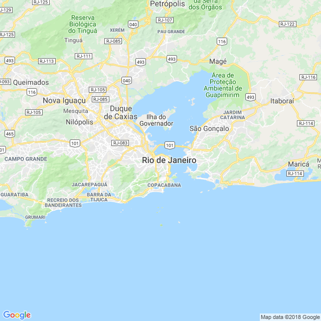
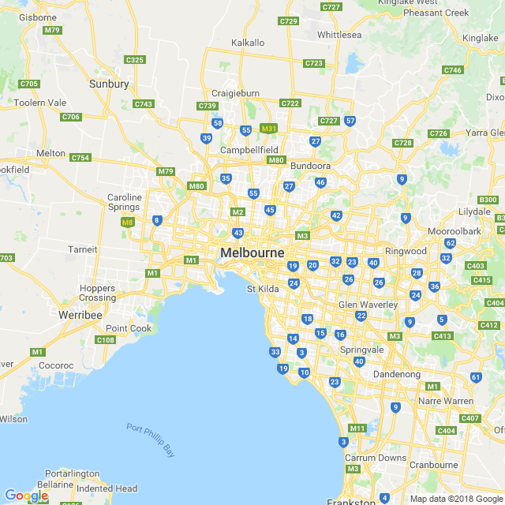

```{r setup, include=FALSE, echo = F, warning = F, message = F}
knitr::opts_chunk$set(echo = F)

# source("../worldfactbook.R")
load("../Data/factbook.Rdata")
load("../Data/BrazilAusExports.Rdata")
export_col_theme <- sample(scales::hue_pal()(15), size = 15)

library(ggthemes)
library(ggmap)
library(ggrepel)
library(ggalt)
map.world <- map_data("world")

library(rworldmap)
library(sp)
library(proj4)
library(rgdal)
library(RgoogleMaps)

library(tidyverse)

```

## Brazil is the 5th largest country


### Pictures

#### Subject-related


<!-- Source: https://upload.wikimedia.org/wikipedia/commons/a/ae/Christ_on_Corcovado_mountain.JPG-->

#### Subject-unrelated


<!-- Source: https://upload.wikimedia.org/wikipedia/commons/9/9a/Petrogale_xanthopus_-_Monarto_1.JPG -->

### Charts

#### Subject-related, Topic-unrelated

```{r, out.width = "60%"}
ggplot(data = brazil_exports) + 
  geom_col(aes(x = ProductCategory, y = TotalTradeMil/1000, fill = ProductCategory)) + 
  ggtitle("Brazil's Exports") + 
  scale_fill_manual(guide = F, values = export_col_theme) +
  xlab("") + 
  scale_y_continuous("Value (Billions, USD)") + 
  coord_flip()
```

#### Subject-unrelated, Topic-unrelated

```{r, out.width = "60%"}
ggplot(data = aus_exports) + 
  geom_col(aes(x = ProductCategory, y = TotalTradeMil/1000, fill = ProductCategory)) + 
  ggtitle("Australia's Exports") + 
  scale_fill_manual(guide = F, values = export_col_theme) +
  xlab("") + 
  scale_y_continuous("Value (Billions, USD)") + 
  coord_flip()
```

#### Subject-related, Topic-related (Probative)

```{r, out.width = "60%"}
areas %>%
  filter(!name %in% c("World", "European Union", "Antarctica") & ! str_detect(name, "Ocean")) %>%
  arrange(desc(total)) %>%
  filter(row_number() <= 10) %>%
  mutate(name = factor(name, levels = name)) %>%
  gather(key = type, value = value, land, water) %>% 
  mutate(type = factor(type, levels = c("water", "land"))) %>%
  ggplot() + 
  geom_col(aes(x = name, y = value, fill = type)) + 
  xlab("") + 
  ylab("Area (sqare km)") + 
  scale_fill_manual(guide = F, values = c("steelblue1", "springgreen4")) + 
  ggtitle("Largest 10 Countries, by Total Area")
```

#### Subject-unrelated, Topic-related 

```{r, out.width = "60%"}
areas %>%
  right_join(
    filter(location, simple == "Europe"),
    by = c("abbr", "name")
  ) %>%
  filter(!name %in% c("World", "European Union", "Antarctica") & ! str_detect(name, "Ocean")) %>%
  arrange(desc(total)) %>%
  filter(row_number() <= 10) %>%
  mutate(name = factor(name, levels = name)) %>%
  gather(key = type, value = value, land, water) %>% 
  mutate(type = factor(type, levels = c("water", "land"))) %>%
  ggplot() + 
  geom_col(aes(x = name, y = value, fill = type)) + 
  xlab("") + 
  ylab("Area (sqare km)") + 
  scale_fill_manual(guide = F, values = c("steelblue1", "springgreen4")) + 
  ggtitle("Largest 10 Countries in Europe, by Total Area")
```

### Maps

#### Subject-related, topic-unrelated

```{r, out.width = "60%", include = F}
newmap <- GetMap(center = c(-22.9083, -43.1963), zoom = 10, destfile = "RioMap.png")
```



#### Subject-unrelated, topic-unrelated

```{r, out.width = "60%", include = F}
newmap <- GetMap(center = c(-37.8136, 144.9631), zoom = 10, destfile = "MelbourneMap.png")
```



#### Subject-related, topic-related (Non-probative)

```{r, out.width = "60%"}
brazillims <- filter(map.world, region == "Brazil") %>%
  summarize(long_min = min(long), long_max = max(long), lat_min = min(lat), lat_max = max(lat))

submapbrazil <- filter(map.world, 
                 long < brazillims$long_max*.95, long > brazillims$long_min*1.05, 
                 lat > brazillims$lat_min*1.08, lat < brazillims$lat_max*2)
mapsubsetbrazil <- filter(map.world, region %in% submapbrazil$region) %>%
  mutate(fill = region == "Brazil")

ggplot(data = arrange(mapsubsetbrazil, group, order)) + 
  geom_polygon(aes(x = long, y = lat, group = group, fill = fill), color = "black") + 
  scale_fill_manual(guide = F, values = c("FALSE" = "grey40", "TRUE" = "darkgreen")) + 
  coord_map(projection = "ortho", orientation = c(-25, -55, 0),
            xlim = c(brazillims$long_min*1.05, brazillims$long_max*.95),
            ylim = c(brazillims$lat_min*1.08, brazillims$lat_max*2)) + 
  theme(axis.text.x = element_blank(), axis.text.y = element_blank(), axis.title = element_blank(), axis.ticks = element_blank())

rm(brazillims, submapbrazil, mapsubsetbrazil)

```


#### Subject-unrelated, topic-related (Non-probative)

```{r, out.width = "60%"}
lims <- filter(map.world, region == "Australia") %>%
  filter(!subregion %in% "Macquarie Island") %>%
  summarize(long_min = min(long), long_max = max(long), lat_min = min(lat), lat_max = max(lat))

submap <- filter(map.world, 
                 long > lims$long_min*.95, 
                 long < lims$long_max*1.05, 
                 lat > lims$lat_min*1.05, 
                 lat < lims$lat_max*.95)
mapsubset <- filter(map.world, region %in% submap$region) %>%
  mutate(fill = region == "Australia")

ggplot(data = arrange(mapsubset, group, order)) + 
  geom_polygon(aes(x = long, y = lat, group = group, fill = fill), color = "black") + 
  scale_fill_manual(guide = F, values = c("FALSE" = "grey40", "TRUE" = "darkgreen")) + 
  coord_map(
    projection = "ortho",
    orientation = c(5, 136, 0),
    xlim = c(lims$long_min, lims$long_max) * c(.95, 1.05),
    ylim = c(lims$lat_min, lims$lat_max) * c(1.05, .95)) + 
  theme(axis.text.x = element_blank(), axis.text.y = element_blank(), axis.title = element_blank(), axis.ticks = element_blank(),
        panel.background = element_rect(fill = "skyblue"))

rm(lims, submap, mapsubset)

```

#### Subject-related, topic-related (probative)

```{r, out.width = "60%", message = F, warning = F}

world <- readOGR("../Data/countries.geo.json", "OGRGeoJSON", stringsAsFactors=FALSE)
world_data <- data_frame(
  name = as.character(world@data$name),
  id = rownames(world@data)
)

world_map <- fortify(world)

plates_map <- readOGR("../Data/plates.json", "OGRGeoJSON", stringsAsFactors = F) %>% fortify()

top10 <- areas %>%
  filter(!name %in% c("World", "European Union", "Antarctica") & ! str_detect(name, "Ocean")) %>%
  arrange(desc(land)) %>%
  mutate(rank = ifelse(row_number() <= 10, row_number(), NA)) %>%
  mutate(name = str_replace(name, "United States", "United States of America")) %>%
  select(name, rank) %>%
  full_join(world_data)

ggplot() + 
  geom_cartogram(data=plates_map, map=plates_map,
                 aes(x=long, y=lat, map_id=id),
                 color="black", size=0.1, fill="#00000000", alpha=0) + 
  geom_cartogram(aes(x = long, y = lat, map_id = id), data = world_map, map = world_map, color = "black") + 
  geom_cartogram(aes(fill = factor(rank), map_id = id), color = "black", map = world_map, data = top10) + 
  coord_map("mollweide") + 
  scale_fill_ptol(guide = F, na.value = "grey80") + 
  theme_map()
```