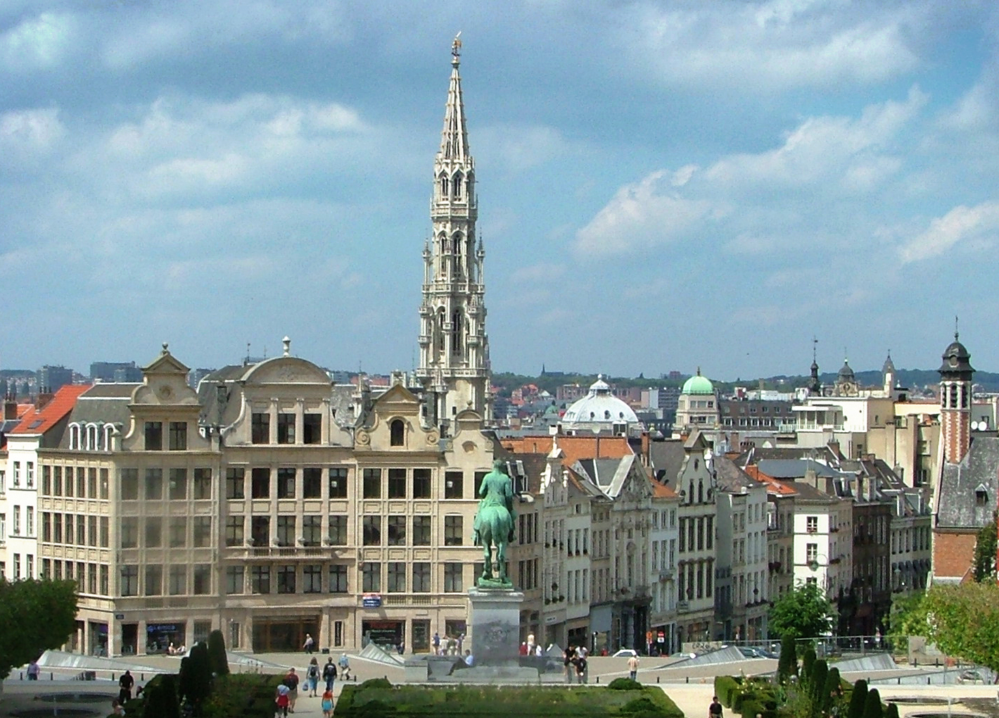

```{r setup, include=FALSE, echo = F, warning = F, message = F}
opt <- "Belgium_Urban"
knitr::opts_chunk$set(echo = F, warning = F, message = F)

# source(here::here("worldfactbook.R"))
load(here::here("Facts/Data/factbook.Rdata"))
load(here::here("Facts/Data/hydro.Rdata"))
library(ggthemes)
# library(ggmap)
library(ggrepel)
# library(ggalt)
map.world <- map_data("world")

library(ggmap)

library(tidyverse)

library(geojsonio)
belgium_italy <- geojson_read(here::here("Facts/Data/belgiumItaly.geo.json"), what = "sp")
belgium_italy_data <- data_frame(
  name = as.character(belgium_italy@data$name),
  id = rownames(belgium_italy@data)
)


belgium_italy <- fortify(belgium_italy) %>%
  left_join(belgium_italy_data)
rm(belgium_italy_data)

world <- map_data("world")
```

## Over 95% of Belgium's population lives in urban areas


### Pictures

#### Subject-related

```{r echo = FALSE, out.width="60%"}
source <- "https://www.goodfreephotos.com/cache/belgium/brussels/brussels-plaza-in-belgium-hdr.jpg"
download.file(source, here::here(paste0("Facts/Single_Fact_Files/", opt, "/", "picture_subject_related.jpg")))
tmp  <- file.copy(
  here::here(paste0("Facts/Single_Fact_Files/", opt, "/", "picture_subject_related.jpg")),
  here::here(sprintf("Facts/Pictures_all/%s-picture_subject_related.jpg", opt)), 
  overwrite = T)

```
<!-- Pilot study Source: https://upload.wikimedia.org/wikipedia/commons/d/d3/2007_07_Belgium_Brussels_06_%28cropped%29.jpg-->
<!-- Fixed after pilot study to find a more iconic view because no one mentioned the picture. -->

#### Subject-unrelated

```{r echo = FALSE, out.width="60%"}
tmp  <- file.copy(
  here::here(paste0("Facts/Single_Fact_Files/", opt, "/", "picture_subject_unrelated.jpg")),
  here::here(sprintf("Facts/Pictures_all/%s-picture_subject_unrelated.jpg", opt)), 
  overwrite = T)
knitr::include_graphics("picture_subject_unrelated.jpg")
```
<!-- Source: https://upload.wikimedia.org/wikipedia/commons/1/12/Flickr_-_%E2%80%A6trialsanderrors_-_The_Colosseum%2C_Rome%2C_Italy%2C_ca._1896.jpg -->

### Charts

#### Subject-related, Topic-unrelated

```{r, out.width = "60%"}
cc <- c("Belgium", "Netherlands", "United Kingdom")
unnest(borders2) %>%
  filter(country %in% cc) %>%
  bind_rows(data_frame(name = cc, country = cc)) %>%
  select(name) %>%
  unique() %>%
  arrange(name) %>%
  left_join(population, by = "name") %>%
  filter(!is.na(Pct)) %>%
  mutate(name = factor(name, levels = unique(name)),
         age = factor(age, levels = rev(levels(age)))) %>%
ggplot() + 
  geom_col(aes(x = name, y = Pct, fill = age), position = "stack") + 
  ggtitle("Demographics in Western Europe") + 
  scale_fill_brewer("Age", type = "qual", palette = "Paired") +
  xlab("") + 
  scale_y_continuous("% Population") + 
  coord_flip()
ggsave(here::here(sprintf("Facts/Pictures_all/%s-chart_subj_rel_topic_unrel_nonprobative.png", opt)), width = 6, height = 4, dpi = 300)
```

#### Subject-unrelated, Topic-unrelated

```{r, out.width = "60%"}
unnest(borders2) %>%
  filter(country %in% c("Greece", "Italy")) %>%
  bind_rows(data_frame(name = c("Italy", "Greece"), country = c("Italy", "Greece"))) %>%
  select(name) %>%
  arrange(name) %>%
  left_join(population, by = "name") %>%
  filter(!is.na(Pct)) %>%
  mutate(name = factor(name, levels = unique(name)),
         age = factor(age, levels = rev(levels(age)))) %>%
ggplot() + 
  geom_col(aes(x = name, y = Pct, fill = age), position = "stack") + 
  ggtitle("Demographics in Southern Europe") + 
  scale_fill_brewer("Age", type = "qual", palette = "Paired") +
  xlab("") + 
  scale_y_continuous("% Population") + 
  coord_flip()
ggsave(here::here(sprintf("Facts/Pictures_all/%s-chart_subj_unrel_topic_unrel_nonprobative.png", opt)), 
       width = 6, height = 5, dpi = 300)
```

#### Subject-related, Topic-related (Probative)

```{r, out.width = "60%"}
cc <- c("Belgium", "Netherlands", "United Kingdom")
unnest(borders2) %>%
  filter(country %in% cc) %>%
  bind_rows(data_frame(name = cc, country = cc)) %>%
  select(name) %>%
  unique() %>%
  arrange(name) %>%
  left_join(location, by = "name") %>%
  select(name, urban = urbanPct) %>%
  mutate(rural = 100 - urban) %>%
  arrange(desc(urban)) %>%
  mutate(name = factor(name)) %>%
  gather(key = type, value = Pct, urban:rural) %>%
  ggplot() + 
  geom_col(aes(x = name, y = Pct, fill = type), position = "stack") + 
  ggtitle("Urbanization in Western Europe") + 
  scale_fill_brewer("", type = "qual", palette = "Paired") +
  xlab("") + 
  scale_y_continuous("% Population") + 
  coord_flip()
ggsave(here::here(sprintf("Facts/Pictures_all/%s-chart_subj_rel_topic_rel_probative.png", opt)), 
       width = 6, height = 4, dpi = 300)
```

#### Subject-unrelated, Topic-related 

```{r, out.width = "60%"}
cc <- c("Greece", "Italy")
unnest(borders2) %>%
  filter(country %in% cc) %>%
  bind_rows(data_frame(name = cc, country = cc)) %>%
  select(name) %>%
  unique() %>%
  arrange(name) %>%
  left_join(location, by = "name") %>%
  select(name, urban = urbanPct) %>%
  mutate(rural = 100 - urban) %>%
  arrange(desc(urban)) %>%
  mutate(name = factor(name)) %>%
  gather(key = type, value = Pct, urban:rural) %>%
  ggplot() + 
  geom_col(aes(x = name, y = Pct, fill = type), position = "stack") + 
  ggtitle("Urbanization in Southern Europe") + 
  scale_fill_brewer("", type = "qual", palette = "Paired") +
  xlab("") + 
  scale_y_continuous("% Population") + 
  coord_flip()
ggsave(here::here(sprintf("Facts/Pictures_all/%s-chart_subj_unrel_topic_rel_nonprobative.png", opt)), 
       width = 6, height = 5, dpi = 300)
```

### Maps

#### Subject-related, topic-unrelated

```{r, out.width = "60%", include = T}
region <- "Europe"
cc <- c("Italy", "Greece")
ccr <- unnest(borders2) %>%
  filter(country %in% cc) %>%
  bind_rows(data_frame(name = cc, country = cc)) %>%
  select(name) %>%
  unique() %>%
  arrange(name) %>%
  magrittr::extract2("name")

tmp <- filter(location, str_detect(simple, region)) %>%
  select(name) %>%
  left_join(population, by = 'name') %>%
  mutate(name = str_replace_all(name, c("United Kingdom" = "UK"))) %>%
  filter(age == "65+") %>%
  filter(!is.na(Pct)) %>%
  select(name, pct_old = Pct) %>%
  mutate(pct_old = cut(pct_old, seq(5, 35, 5))) %>%
  full_join(world, by = c("name" = "region"))

lims <- tmp %>%
  filter(is.na(subregion)) %>%
  right_join(filter(location, name %in% ccr)) %>%
  select(lat, long) %>%
  summarize_all(.funs = funs(min, max), na.rm = T)

labs <- location %>%
  filter(name %in% c(ccr, "Italy", "Spain")) %>%
  filter(!name %in% c("Switzerland", "San Marino", "Slovenia", "Macedonia", "Holy See (Vatican City)", "Turkey"))


tmp %>%
  ggplot() + 
  geom_polygon(aes(x = long, y = lat, group = group), color = "black", fill = "grey50") + 
  geom_polygon(aes(x = long, y = lat, fill = pct_old, group = group), color = "black", data = filter(tmp, !is.na(pct_old))) + 
  coord_quickmap(xlim = c(lims$long_min, 25), ylim = c(lims$lat_min, lims$lat_max), expand = T) + 
  geom_label_repel(aes(x = label_long, y = label_lat, label = name), data = labs) + 
  theme(axis.text = element_blank(), axis.ticks = element_blank(), axis.title = element_blank()) + 
  scale_fill_discrete("% Population 65+") + 
  ggtitle("Population Over 65")
ggsave(here::here(sprintf("Facts/Pictures_all/%s-map_subj_unrel_topic_unrel_nonprobative.png", opt)),
       width = 6, height = 4, dpi = 300)
```

#### Subject-unrelated, topic-unrelated

```{r, out.width = "60%", include = T}
region <- "Europe"
cc <- c("Belgium", "Netherlands", "United Kingdom", "Ireland")
ccr <- unnest(borders2) %>%
  filter(country %in% cc) %>%
  bind_rows(data_frame(name = cc, country = cc)) %>%
  select(name) %>%
  unique() %>%
  arrange(name) %>%
  magrittr::extract2("name")

tmp <- filter(location, str_detect(simple, region)) %>%
  select(name) %>%
  left_join(population, by = 'name') %>%
  mutate(name = str_replace_all(name, c("United Kingdom" = "UK", "Czechia"= "Czech Republic"))) %>%
  filter(age == "65+") %>%
  filter(!is.na(Pct)) %>%
  select(name, pct_old = Pct) %>%
  mutate(pct_old = cut(pct_old, seq(5, 35, 5))) %>%
  full_join(world, by = c("name" = "region"))

lims <- tmp %>%
  filter(name %in% ccr) %>%
  select(lat, long) %>%
  summarize_all(.funs = funs(min, max), na.rm = T)

labs <- location %>%
  filter(name %in% c(ccr, "Italy", "Spain")) 


tmp %>%
  ggplot() + 
  geom_polygon(aes(x = long, y = lat, group = group), color = "black", fill = "grey50") + 
  geom_polygon(aes(x = long, y = lat, fill = pct_old, group = group), color = "black", data = filter(tmp, !is.na(pct_old))) + 
  geom_label_repel(aes(x = label_long, y = label_lat, label = name), data = labs, label.padding = .3) + 
  coord_quickmap(xlim = c(lims$long_min, lims$long_max), ylim = c(lims$lat_min, lims$lat_max), expand = T) + 
  theme(axis.text = element_blank(), axis.ticks = element_blank(), axis.title = element_blank()) + 
  scale_fill_discrete("% Population 65+") + 
  ggtitle("Population Over 65")
ggsave(here::here(sprintf("Facts/Pictures_all/%s-map_subj_rel_topic_unrel_nonprobative.png", opt)),
       width = 6, height = 4, dpi = 300)
```

#### Subject-related, topic-related (Non-probative)

```{r, out.width = "60%"}
belgiummap <- filter(belgium_italy, name == "Belgium") %>%
  arrange(id, group, order)
belgiumbox <- c(left = min(belgiummap$long), bottom = min(belgiummap$lat), right = max(belgiummap$long), top = max(belgiummap$lat))
if (!file.exists(here::here("Facts/Data/belgiummaptiles.Rdata"))) {
  belgiummaptiles <- get_stamenmap(belgiumbox, zoom = 8) 
  save(belgiummaptiles, file = here::here("Facts/Data/belgiummaptiles.Rdata"))
} else {
  load(here::here("Facts/Data/belgiummaptiles.Rdata"))
}
belgiummaptiles %>% ggmap() + 
  geom_path(aes(x = long, y = lat, group = group), data = belgiummap, color = "red", alpha = .5) + 
  theme_map() + 
  ggtitle("Belgium")
ggsave(here::here(sprintf("Facts/Pictures_all/%s-map_subj_rel_topic_rel_nonprobative.png", opt)), 
       width = 5, height = 4, dpi = 300)
rm(belgiummap, belgiumbox, belgiummaptiles)
```


#### Subject-unrelated, topic-related (Non-probative)

```{r, out.width = "60%"}
italymap <- filter(belgium_italy, name == "Italy") %>%
  arrange(id, group, order)
italybox <- c(left = min(italymap$long), bottom = min(italymap$lat), right = max(italymap$long), top = max(italymap$lat))
if (!file.exists(here::here("Facts/Data/italymaptiles.Rdata"))) {
  italymaptiles <- get_stamenmap(italybox, zoom = 6)
  save(italymaptiles, file = here::here("Facts/Data/italymaptiles.Rdata"))
} else {
  load(here::here("Facts/Data/italymaptiles.Rdata"))
}
italymaptiles %>% ggmap() + 
  geom_path(aes(x = long, y = lat, group = group), data = italymap, color = "red", alpha = .5) + 
  theme_map() + 
  ggtitle("Italy")
ggsave(here::here(sprintf("Facts/Pictures_all/%s-map_subj_unrel_topic_rel_nonprobative.png", opt)), 
       width = 5, height = 4, dpi = 300)

rm(italymap, italymaptiles, italybox)
```

#### Subject-related, topic-related (probative)

```{r, out.width = "60%", message = F, warning = F, fig.width = 6, fig.height = 6}
region <- "Europe"
cc <- c("Belgium", "Netherlands", "United Kingdom", "Ireland")
ccr <- unnest(borders2) %>%
  filter(country %in% cc) %>%
  bind_rows(data_frame(name = cc, country = cc)) %>%
  select(name) %>%
  unique() %>%
  arrange(name) %>%
  magrittr::extract2("name")

tmp <- filter(location, str_detect(simple, region)) %>%
  select(name) %>%
  left_join(location, by = 'name') %>%
  mutate(name = str_replace_all(name, c("United Kingdom" = "UK", "Czechia"= "Czech Republic"))) %>%
  filter(!is.na(urbanPct)) %>%
  select(name, urban = urbanPct) %>%
  mutate(urban = cut(urban, c(seq(5, 100, 10), 100))) %>%
  full_join(world, by = c("name" = "region"))

lims <- tmp %>%
  filter(name %in% ccr) %>%
  select(lat, long) %>%
  summarize_all(.funs = funs(min, max), na.rm = T)

labs <- location %>%
  filter(name %in% c("France", "Germany", "United Kingdom", "Italy", "Spain", "Belgium"))  %>%
  mutate(name = str_replace_all(name, c("United Kingdom" = "UK", "Czechia"= "Czech Republic"))) 

tmp %>%
  ggplot() + 
  geom_polygon(aes(x = long, y = lat, group = group), color = "black", fill = "grey50") + 
  geom_polygon(aes(x = long, y = lat, fill = urban, group = group), color = "black", data = filter(tmp, !is.na(urban))) + 
  geom_label_repel(aes(x = label_long, y = label_lat, label = name), data = labs, label.padding = .4) + 
  coord_quickmap(xlim = c(lims$long_min, lims$long_max), ylim = c(lims$lat_min, lims$lat_max), expand = T) + 
  theme(axis.text = element_blank(), axis.ticks = element_blank(), axis.title = element_blank(), legend.direction = "horizontal", legend.position = "bottom") + 
  scale_fill_brewer("% Population\nin Urban Areas") + 
  ggtitle("Urbanization in Europe")
ggsave(here::here(sprintf("Facts/Pictures_all/%s-map_subj_rel_topic_rel_probative.png", opt)), 
       width = 6, height = 6, dpi = 300)


```

