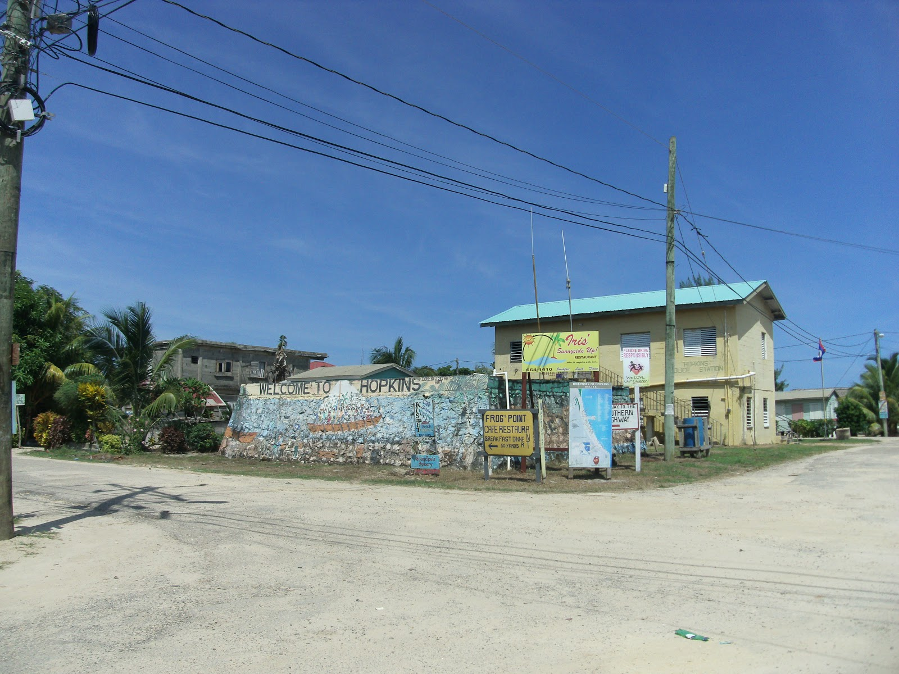

```{r setup, include=FALSE, echo = F, warning = F, message = F}
knitr::opts_chunk$set(echo = F, warning = F, message = F, dpi = 300)

# source(here::here("worldfactbook.R"))
load(here::here("Data/factbook.Rdata"))

library(ggthemes)
library(ggmap)
library(ggrepel)
library(ggalt)
map.world <- map_data("world")

library(rworldmap)
library(sp)
library(proj4)
library(rgdal)
library(RgoogleMaps)

library(tidyverse)

```

## Less than 85% of the population of Belize has access to electricity


### Pictures

#### Subject-related


<!-- Source: http://1.bp.blogspot.com/-p0OBR72bu6c/UH8kh7emMfI/AAAAAAAAEbo/DmN6K0qk4bc/s1600/028.JPG-->

#### Subject-unrelated


<!-- Source: https://upload.wikimedia.org/wikipedia/commons/b/b4/African_lion%2C_Panthera_leo_at_Krugersdorp_Game_Park%2C_South_Africa_%2830479241254%29.jpg -->

### Charts

#### Subject-related, Topic-unrelated

```{r, out.width = "60%"}
filter(population, name == "Belize") %>%
  select(name, age, Female, Male) %>%
  gather(key = gender, value = value, -name, -age) %>%
  mutate(value = as.numeric(value)) %>%
ggplot() + 
  geom_col(aes(x = age, y = value/1e3, fill = gender), position = "dodge", color = "black") + 
  ggtitle("Population of Belize") + 
  xlab("Age") + 
  scale_y_continuous("Population (Thousands)") + 
  scale_fill_discrete("Gender") + 
  theme(legend.position = c(1, 1), legend.justification = c(1,1), legend.background = element_rect(fill = "transparent"))
```

#### Subject-unrelated, Topic-unrelated

```{r, out.width = "60%"}
filter(population, name == "Kenya") %>%
  select(name, age, Female, Male) %>%
  gather(key = gender, value = value, -name, -age) %>%
  mutate(value = as.numeric(value)) %>%
ggplot() + 
  geom_col(aes(x = age, y = value/1e6, fill = gender), position = "dodge", color = "black") + 
  ggtitle("Population of Kenya") + 
  xlab("Age") + 
  scale_y_continuous("Population (Millions)") + 
  scale_fill_discrete("Gender") + 
  theme(legend.position = c(1, 1), legend.justification = c(1,1), legend.background = element_rect(fill = "transparent"))
```

#### Subject-related, Topic-related (Probative)

```{r, out.width = "60%"}
location %>% 
  filter(simple == "Central America") %>%
  select(name, urbanPct) %>%
  left_join(electricity_all) %>%
  select(name, urbanPct, urban_elec, rural_elec, total_elec) %>%
  mutate(urban_elec = urbanPct*urban_elec/100, 
         rural_elec = (100 - urbanPct)*rural_elec/100) %>%
  select(-urbanPct) %>%
  arrange(desc(total_elec)) %>%
  mutate(name = factor(name, levels = name)) %>%
  gather(key = popType, value = value, -name, -total_elec) %>%
  mutate(popType = str_replace(popType, "_elec", "") %>% str_to_title) %>%
  mutate(value = as.numeric(value)) %>%
ggplot() + 
  geom_col(aes(x = name, y = value, fill = popType), position = "stack", color = "black") + 
  ggtitle("Electricity Access in Central America") + 
  xlab("") + 
  scale_y_continuous("% with Electrical Access") + 
  scale_fill_discrete("Population Type") + 
  theme(legend.position = c(1, 1), legend.justification = c(1,1), legend.background = element_rect(fill = "transparent"),
        legend.direction = "horizontal")
```

#### Subject-unrelated, Topic-related 

```{r, out.width = "60%"}
electricity_all %>%
  filter(name %in% c("Congo, Democratic Republic of the", "Zambia", "Malawi", 
                     "Rwanda", "Burundi", "Tanzania", "Uganda", 
                     "Kenya", "South Sudan", "Ethiopia", "Somalia")) %>%
  left_join(select(location, name, urbanPct)) %>%
  select(name, urbanPct, urban_elec, rural_elec, total_elec) %>%
  mutate(urban_elec = urbanPct*urban_elec/100, 
         rural_elec = (100 - urbanPct)*rural_elec/100) %>%
  select(-urbanPct) %>%
  mutate(total2 = urban_elec + rural_elec) %>%
  arrange(desc(total2)) %>%
  mutate(name = factor(name, levels = name, labels = str_replace(name, "Congo, Democratic Republic of the", "Dem. Rep.\nof the\nCongo") %>%
                         str_replace("South Sudan", "South\nSudan"))) %>%
  gather(key = popType, value = value, -name, -total_elec, -total2) %>%
  mutate(popType = str_replace(popType, "_elec", "") %>% str_to_title) %>%
  mutate(value = as.numeric(value)) %>%
ggplot() + 
  geom_col(aes(x = name, y = value, fill = popType), position = "stack", color = "black") + 
  ggtitle("Electricity Access in East Central Africa") + 
  xlab("") + 
  scale_y_continuous("% with Electrical Access") + 
  scale_fill_discrete("Population Type") + 
  theme(legend.position = c(1, 1), legend.justification = c(1,1), legend.background = element_rect(fill = "transparent"),
        legend.direction = "horizontal")
```

### Maps

#### Subject-related, topic-unrelated

```{r, out.width = "60%", include = T}
# newmap <- GetMap(center = c(17.2, -88.8), zoom = 7, destfile = "BelizeMap.png")
cAmLabels <- filter(location, simple == "Central America") %>%
  mutate(label_long = ifelse(name == "Belize", label_long + .5, label_long),
         label_lat = ifelse(name == "Guatemala", label_lat - .5, label_lat),
         label_lat = ifelse(name == "El Salvador", label_lat - .25, label_lat),
         label_long = ifelse(name == "El Salvador", label_long - 1, label_long))

filter(location, simple == "Central America") %>%
  select(name) %>%
  full_join(map.world, by = c("name" = "region")) %>%
  ggplot() +
  geom_polygon(aes(x = long, y = lat, group = group), fill = "grey40", color = "black") +
  geom_label_repel(aes(x = label_long, y = label_lat, label = name), data = cAmLabels) +
  coord_map(projection = "ortho", orientation = c(12, -84, 0), xlim = c(-92.2, -77.2), ylim = c(7.22, 18.5)) +
  theme(axis.text.x = element_blank(), axis.text.y = element_blank(), axis.title = element_blank(), axis.ticks = element_blank(), legend.position = c(0, 0), legend.justification = c(0, 0), legend.background = element_rect(fill = "transparent")) +
  ggtitle("Central America")
```

<!--  -->


#### Subject-unrelated, topic-unrelated

```{r, out.width = "60%"}
# newmap <- GetMap(center = c(1, 38), zoom = 8, destfile = "KenyaMap.png")
countryList <- c("Congo, Democratic Republic of the", "Zambia", "Malawi", 
                 "Rwanda", "Burundi", "Tanzania", "Uganda", 
                 "Kenya", "South Sudan", "Ethiopia", "Somalia")

AfrLabels <- filter(location, name %in% countryList) %>%
  filter(!name %in% c("Zambia", "Malawi")) %>%
  mutate(name = str_replace(name, ".*Congo.*", "Dem.\nRep.\nof the\nCongo")) %>%
  mutate(label_lat = ifelse(name == "Somalia", label_lat - 6, label_lat),
         label_long = ifelse(name == "Somalia", label_long - 2, label_long),
         label_lat = ifelse(name == "Uganda", label_lat + 1, label_lat),
         label_long = ifelse(name == "Uganda", label_long + 1, label_long),
         label_long = ifelse(name == "South Sudan", label_long - 2, label_long))

filter(location, name %in% countryList) %>%
  select(name) %>%
  mutate(name = str_replace(name, "Congo, D.*", "Democratic Republic of the Congo")) %>%
  full_join(map.world, by = c("name" = "region")) %>%
  ggplot() +
  geom_polygon(aes(x = long, y = lat, group = group), fill = "grey40", color = "black") +
  geom_label_repel(aes(x = label_long, y = label_lat, label = name), data = AfrLabels) +
  coord_map(projection = "ortho", orientation = c(1, 17, 0), xlim = c(26, 48), ylim = c(-7, 9)) +
  theme(axis.text.x = element_blank(), axis.text.y = element_blank(), axis.title = element_blank(), axis.ticks = element_blank(), legend.position = c(0, 0), legend.justification = c(0, 0), legend.background = element_rect(fill = "transparent")) +
  ggtitle("East Central Africa")
```

<!--  -->

#### Subject-related, topic-related (Non-probative)

```{r, out.width = "60%"}
cAmLabels <- filter(location, simple == "Central America") %>%
  mutate(label_long = ifelse(name == "Belize", label_long + .5, label_long),
         label_lat = ifelse(name == "Guatemala", label_lat - .5, label_lat),
         label_lat = ifelse(name == "El Salvador", label_lat - .25, label_lat),
         label_long = ifelse(name == "El Salvador", label_long - 1, label_long))

filter(location, simple == "Central America") %>%
  select(name) %>%
  left_join(electricity_all, by = "name") %>%
  select(name, FossilFuels) %>%
  full_join(map.world, by = c("name" = "region")) %>%
  ggplot() +
  geom_polygon(aes(x = long, y = lat, group = group, fill = FossilFuels), color = "black") +
  geom_label_repel(aes(x = label_long, y = label_lat, label = name), data = cAmLabels) +
  scale_fill_gradient("% Power from\nFossil Fuels", low = "white", high = "navy", limits = c(0, 100)) + 
  coord_map(projection = "ortho", orientation = c(12, -84, 0), xlim = c(-92.2, -77.2), ylim = c(7.22, 18.5)) +
  theme(axis.text.x = element_blank(), axis.text.y = element_blank(), axis.title = element_blank(), axis.ticks = element_blank(), legend.position = c(0, 0), legend.justification = c(0, 0), legend.background = element_rect(fill = "transparent")) +
  ggtitle("Fossil Fuel Electrical Generation in Central America")
```


#### Subject-unrelated, topic-related (Non-probative)

```{r, out.width = "60%"}
countryList <- c("Congo, Democratic Republic of the", "Zambia", "Malawi", 
                 "Rwanda", "Burundi", "Tanzania", "Uganda", 
                 "Kenya", "South Sudan", "Ethiopia", "Somalia",
                 "Central African Republic")

AfrLabels <- filter(location, name %in% countryList) %>%
  filter(!name %in% c("Zambia", "Malawi", "Central African Republic")) %>%
  mutate(name = str_replace(name, ".*Congo.*", "Dem.\nRep.\nof the\nCongo")) %>%
  mutate(label_lat = ifelse(name == "Somalia", label_lat - 6, label_lat),
         label_long = ifelse(name == "Somalia", label_long - 2, label_long),
         label_lat = ifelse(name == "Uganda", label_lat + 1, label_lat),
         label_long = ifelse(name == "Uganda", label_long + 1, label_long),
         label_long = ifelse(name == "South Sudan", label_long - 2, label_long))

filter(location, name %in% countryList) %>%
  select(name) %>%
  left_join(electricity_all, by = "name") %>%
  select(name, total_elec) %>%
  mutate(name = str_replace(name, "Congo, D.*", "Democratic Republic of the Congo")) %>%
  full_join(map.world, by = c("name" = "region")) %>%
  ggplot() +
  geom_polygon(aes(x = long, y = lat, group = group, fill = total_elec), color = "black") +
  geom_label_repel(aes(x = label_long, y = label_lat, label = name), data = AfrLabels) +
  scale_fill_gradient("% Population\nwith Electricity", low = "white", high = "navy", limits = c(0, 50)) + 
  coord_map(projection = "ortho", orientation = c(1, 17, 0), xlim = c(26, 48), ylim = c(-7, 9)) +
  theme(axis.text.x = element_blank(), axis.text.y = element_blank(), axis.title = element_blank(), axis.ticks = element_blank(), legend.position = c(1, 0), legend.justification = c(1, 0), legend.background = element_rect(fill = "transparent")) +
  ggtitle("Electrical Access in East Central Africa")
```

#### Subject-related, topic-related (probative)

```{r, out.width = "60%", message = F, warning = F}
cAmLabels <- filter(location, simple == "Central America") %>%
  mutate(label_long = ifelse(name == "Belize", label_long + .5, label_long),
         label_lat = ifelse(name == "Guatemala", label_lat - .5, label_lat),
         label_lat = ifelse(name == "El Salvador", label_lat - .25, label_lat),
         label_long = ifelse(name == "El Salvador", label_long - 1, label_long))

filter(location, simple == "Central America") %>%
  select(name) %>%
  left_join(electricity_all, by = "name") %>%
  select(name, total_elec) %>%
  full_join(map.world, by = c("name" = "region")) %>%
  ggplot() +
  geom_polygon(aes(x = long, y = lat, group = group, fill = total_elec), color = "black") +
  geom_label_repel(aes(x = label_long, y = label_lat, label = name), data = cAmLabels) +
  scale_fill_gradient("% Population\nwith Electricity", low = "white", high = "navy", limits = c(50, 100)) + 
  coord_map(projection = "ortho", orientation = c(12, -84, 0), xlim = c(-92.2, -77.2), ylim = c(7.22, 18.5)) +
  theme(axis.text.x = element_blank(), axis.text.y = element_blank(), axis.title = element_blank(), axis.ticks = element_blank(), legend.position = c(0, 0), legend.justification = c(0, 0), legend.background = element_rect(fill = "transparent")) +
  ggtitle("Electrical Access in Central America")
```