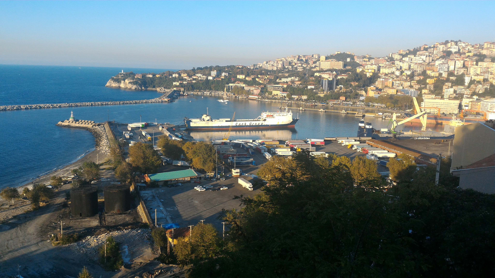
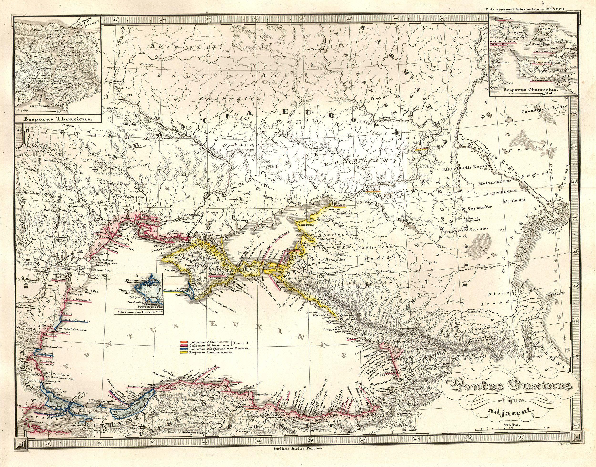
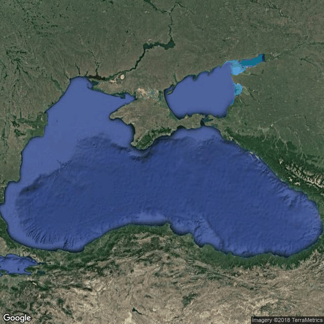
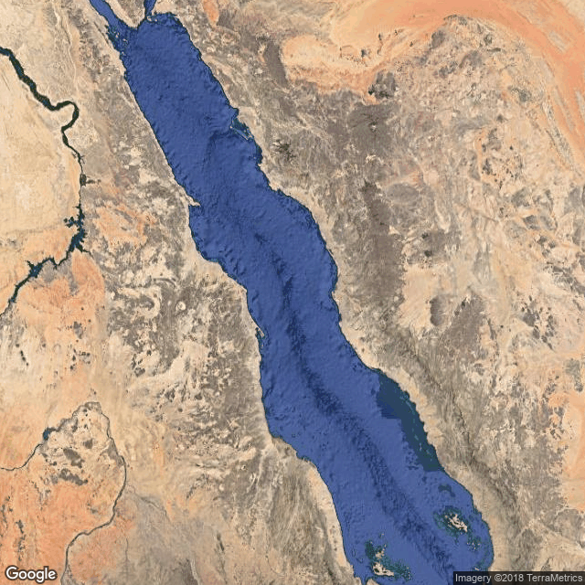
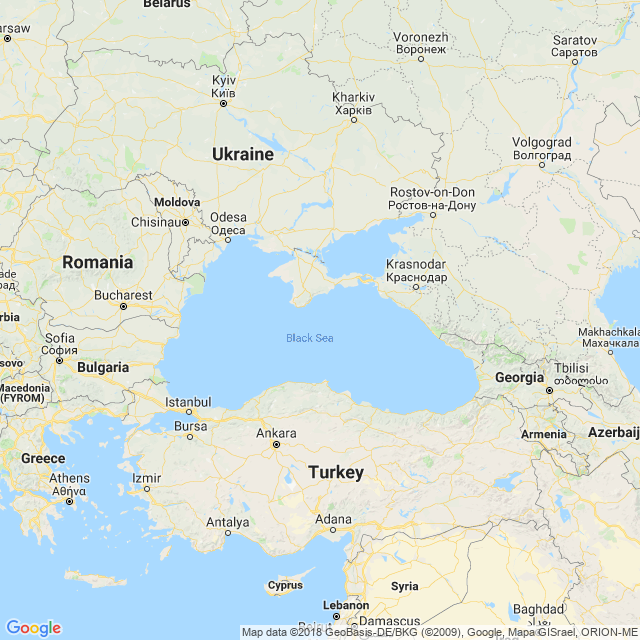

```{r setup, include=FALSE, echo = F, warning = F, message = F}
opt <- "Black_sea"
knitr::opts_chunk$set(echo = F, warning = F, message = F, dpi = 300)

# source(here::here("worldfactbook.R"))
load(here::here("Facts/Data/factbook.Rdata"))

library(ggthemes)
library(ggmap)
library(ggrepel)
library(ggalt)

library(rworldmap)
library(sp)
library(proj4)
library(rgdal)
library(RgoogleMaps)
library(geojsonio)

library(tidyverse)

world <- geojson_read("https://raw.githubusercontent.com/johan/world.geo.json/master/countries.geo.json", method = "web", what = "sp")
world_data <- data_frame(
  name = as.character(world@data$name),
  id = rownames(world@data)
)

world_map <- fortify(world) %>%
  left_join(world_data)
rm(world_data)
world <- map_data("world")
world2 <- map_data("world2")

load(here::here("Facts/Data/Salinity.Rdata"))
load(here::here("Facts/Data/SeaBorders.Rdata"))
```

## Seven countries border the Black Sea


### Pictures

#### Subject-related

```{r echo = FALSE, out.width="60%"}
tmp <- file.copy(
  here::here(paste0("Facts/Single_Fact_Files/", opt, "/", "picture_subject_related.jpg")),
  here::here(sprintf("Facts/Pictures_all/%s-picture_subject_related.jpg", opt)), 
  overwrite = T)

```
<!-- Source: https://upload.wikimedia.org/wikipedia/commons/5/5f/Zonguldak_58.jpg-->

#### Subject-unrelated

```{r echo = FALSE, out.width="60%"}
source <- "https://upload.wikimedia.org/wikipedia/commons/6/63/Jungle_Ruins_%283325672691%29.jpg"
tmp <- download.file(source, here::here(paste0("Facts/Single_Fact_Files/", opt, "/", "picture_subject_unrelated.jpg")), overwrite = T)
tmp <- file.copy(
  here::here(paste0("Facts/Single_Fact_Files/", opt, "/", "picture_subject_unrelated.jpg")),
  here::here(sprintf("Facts/Pictures_all/%s-picture_subject_unrelated.jpg", opt)), 
  overwrite = T)
knitr::include_graphics("picture_subject_unrelated.jpg")
```
<!-- Source: https://upload.wikimedia.org/wikipedia/commons/0/0d/River-Nile-near-Aswan.jpg -->
<!-- Fixed after pilot study to a non-Egypt picture to avoid suggesting the mediterranean/red sea. In the pilot, no one mentioned the picture. -->

### Charts

#### Subject-related, Topic-unrelated

```{r, out.width = "60%"}
salinity %>%
  filter(type %in% c("Mediterranean sea", "Inland sea", "Ocean")) %>%
  filter(name != "Pacific Ocean") %>%
ggplot() + 
  geom_col(aes(x = name, y = salinity_num, fill = name)) + 
  ggtitle("Salinity of Eurasian Bodies of Water") + 
  xlab("") + 
  scale_y_continuous("Salinity (g/kg)") + 
  scale_fill_discrete(guide = F) 
ggsave(here::here(sprintf("Facts/Pictures_all/%s-chart_subj_rel_topic_unrel_nonprobative.png", opt)), 
       width = 6, height = 4, dpi = 300)
```

#### Subject-unrelated, Topic-unrelated

```{r, out.width = "60%"}
areas %>%
  right_join(
    filter(location, simple == "Africa"),
    by = c("abbr", "name")
  ) %>%
  filter(!name %in% c("World", "European Union", "Antarctica") & ! str_detect(name, "Ocean")) %>%
  mutate(name = str_replace(name, "Congo, Democratic Republic of the", "Democratic Republic of the Congo")) %>%
  mutate(name = str_replace_all(name, " ", "\n") %>% str_replace("of\nthe\n", "of the ")) %>%
  arrange(desc(total)) %>%
  mutate(land = ifelse(is.na(land), total, land),
         water = ifelse(is.na(water), 0, water)) %>%
  filter(row_number() <= 10) %>%
  mutate(name = factor(name, levels = name)) %>%
  gather(key = type, value = value, land, water) %>% 
  mutate(type = factor(type, levels = c("water", "land"))) %>%
  ggplot() + 
  geom_col(aes(x = name, y = value, fill = type)) + 
  xlab("") + 
  ylab("Area (square km)") + 
  scale_fill_manual(guide = F, values = c("steelblue1", "springgreen4")) + 
  ggtitle("Largest 10 Countries in Africa, by Total Area")
ggsave(here::here(sprintf("Facts/Pictures_all/%s-chart_subj_unrel_topic_unrel_nonprobative.png", opt)), 
       width = 6, height = 4, dpi = 300)
```

#### Subject-related, Topic-related (Probative)

```{r, out.width = "60%"}

bs_boundaries %>%
  arrange(length) %>%
  filter(length > 1000) %>%
  mutate(Country = factor(name, levels = name)) %>%
  ggplot() + 
  geom_col(aes(x = Country, y = length/1000)) + 
  xlab("") + 
  ylab("Length of Black Sea Coastline (km)") + 
  scale_fill_manual(guide = F, values = c("steelblue1", "springgreen4")) + 
  ggtitle("Black Sea Nations")
ggsave(here::here(sprintf("Facts/Pictures_all/%s-chart_subj_rel_topic_rel_probative.png", opt)), 
       width = 6, height = 4, dpi = 300)
```

#### Subject-unrelated, Topic-related 

```{r, out.width = "60%"}

rs_boundaries %>%
  arrange(length) %>%
  filter(length > 1000) %>%
  mutate(Country = factor(name, levels = name)) %>%
  ggplot() + 
  geom_col(aes(x = Country, y = length/1000)) + 
  xlab("") + 
  ylab("Length of Red Sea Coastline (km)") + 
  scale_fill_manual(guide = F, values = c("steelblue1", "springgreen4")) + 
  ggtitle("Red Sea Nations")

ggsave(here::here(sprintf("Facts/Pictures_all/%s-chart_subj_unrel_topic_rel_nonprobative.png", opt)), 
       width = 6, height = 4, dpi = 300)
```

### Maps

#### Subject-related, topic-unrelated

```{r, include = F}

fname <- "Subject_Related_Nonprobative_Map.jpg"
fsrc <- "https://upload.wikimedia.org/wikipedia/commons/f/fe/1855_Spruneri_Map_of_the_Black_Sea_or_Pontus_Euxinus_in_Ancient_Times_-_Geographicus_-_PontusEuxinus-spruneri-1855.jpg"
if (!file.exists(fname)) {
  download.file(fsrc, destfile = fname)
}
```

```{r echo = FALSE, out.width="60%"}
tmp <- file.copy(
  here::here(paste0("Facts/Single_Fact_Files/", opt, "/", "Subject_Related_Nonprobative_Map.jpg")),
  here::here(sprintf("Facts/Pictures_all/%s-map_subj_rel_topic_unrel_nonprobative.jpg", opt)), 
  overwrite = T)

```

#### Subject-unrelated, topic-unrelated

```{r, out.width = "60%", include = T}
africalabels <- location %>% filter(simple == "Africa") %>%
  left_join(areas) %>%
  mutate(name = str_replace(name, "Congo, (.*)", "\\1 Congo") %>%
           str_replace("^Republic of the Congo", "Republic of Congo") %>%
           str_replace("Eswatini", "Swaziland") %>%
           str_replace("Cabo Verde", "Cape Verde") %>%
           str_replace("Cote d'Ivoire", "Ivory Coast") %>%
           str_replace("Gambia, The", "Gambia") %>%
           str_replace_all(" ", "\n") %>%
           str_replace("of\nthe", "of the")
         ) %>%
  filter(land > 750000 | name == "Sudan") %>%
  mutate(label_lat = ifelse(str_detect(name, "Congo"), label_lat - 1, label_lat))
location %>% filter(simple == "Africa") %>%
  mutate(name = str_replace(name, "Congo, (.*)", "\\1 Congo") %>%
           str_replace("^Republic of the Congo", "Republic of Congo") %>%
           str_replace("Eswatini", "Swaziland") %>%
           str_replace("Cabo Verde", "Cape Verde") %>%
           str_replace("Cote d'Ivoire", "Ivory Coast") %>%
           str_replace("Gambia, The", "Gambia")) %>%
  left_join(world, by = c("name" = "region")) %>%
  ggplot() + 
  geom_polygon(aes(x = long, y = lat, group = group), fill = "white", color = "black") + 
  geom_text(aes(x = label_long, y = label_lat, label = name), data = africalabels, size = 2.5) + 
  coord_map(ylim = c(-35, 40)) + 
  theme_map()
ggsave(here::here(sprintf("Facts/Pictures_all/%s-map_subj_unrel_topic_unrel_nonprobative.png", opt)), 
       width = 5, height = 5, dpi = 300)
```

#### Subject-related, topic-related (Non-probative)

```{r, out.width = "60%"}

# newmap <- GetMap(center = c(44, 34.75), zoom = 6, destfile = "BlackSeaMap.png", maptype = "satellite")

if (!file.exists(here::here("Facts/Data/BlackSeaMapTiles.Rdata"))) {
  blackseamaptiles <- get_googlemap(center = c(34.75, 44), zoom = 6, maptype = "satellite") 
  save(blackseamaptiles, file = here::here("Facts/Data/BlackSeaMapTiles.Rdata"))
} else {
  load(here::here("Facts/Data/BlackSeaMapTiles.Rdata"))
}
blackseamaptiles %>% ggmap() + 
  theme_map() + 
  ggtitle("Black Sea Region")
ggsave(here::here(sprintf("Facts/Pictures_all/%s-map_subj_unrel_topic_rel_nonprobative.png", opt)), 
       width = 5, height = 5, dpi = 300)

```

<!--  -->

#### Subject-unrelated, topic-related (Non-probative)

```{r, out.width = "60%"}

# newmap <- GetMap(center = c(22, 38), zoom = 6, destfile = "RedSeaMap.png", maptype = "satellite")

if (!file.exists(here::here("Facts/Data/BlackSeaMapTiles.Rdata"))) {
  redseamaptiles <- get_googlemap(center = c(38, 22), zoom = 5, maptype = "satellite") 
  save(redseamaptiles, file = here::here("Facts/Data/RedSeaMap.Rdata"))
} else {
  load(here::here("Facts/Data/RedSeaMap.Rdata"))
}
redseamaptiles %>% ggmap() + 
  theme_map() + 
  ggtitle("Red Sea Region")
ggsave(here::here(sprintf("Facts/Pictures_all/%s-map_subj_rel_topic_rel_probative.png", opt)), 
       width = 5, height = 5, dpi = 300)
```

<!--  -->

#### Subject-related, topic-related (probative)

```{r, out.width = "60%"}
# newmap <- GetMap(center = c(44, 34.75), zoom = 5, destfile = "BlackSeaMapLabeled.png")
if (!file.exists(here::here("Facts/Data/BlackSeaMapTiles2.Rdata"))) {
  blackseamaptiles2 <- get_googlemap(center = c(34.75, 44), zoom = 5, maptype = "terrain", language = "en-EN") 
  save(blackseamaptiles2, file = here::here("Facts/Data/BlackSeaMapTiles2.Rdata"))
} else {
  load(here::here("Facts/Data/BlackSeaMapTiles2.Rdata"))
}
blackseamaptiles2 %>% ggmap() + 
  theme_map() + 
  ggtitle("Black Sea Region")
```

<!--  -->
