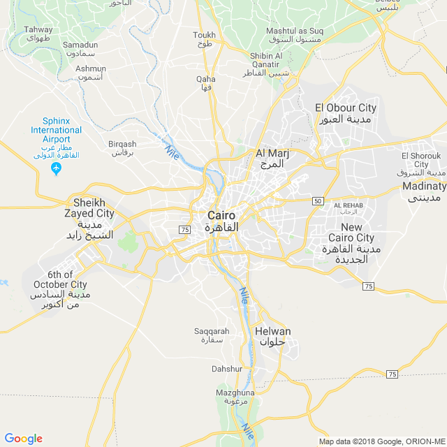
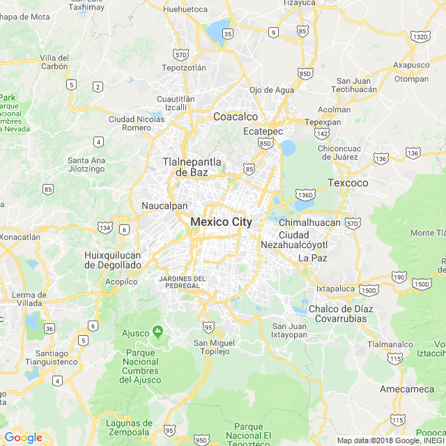

```{r setup, include=FALSE, echo = F, warning = F, message = F}
knitr::opts_chunk$set(echo = F, warning = F, message = F, dpi = 300)
library(RgoogleMaps)
library(tidyverse)

# source(here::here("Code/worldfactbook.R"))
load(here::here("Facts/Data/factbook.Rdata"))
library(ggthemes)
library(ggmap)
library(ggrepel)
map.world <- map_data("world")
```

## Egypt has approximately equal land and coastal borders


### Pictures

#### Subject-related

```{r echo = FALSE, out.width="60%"}

```
<!-- Source: https://commons.wikimedia.org/wiki/File:All_Gizah_Pyramids.jpg-->

#### Subject-unrelated

```{r echo = FALSE, out.width="60%"}
knitr::include_graphics("picture_subject_unrelated.jpg")
```
<!-- Source: https://www.pexels.com/photo/pembroke-welsh-corgi-lying-on-the-sand-under-white-cloud-blue-sky-164186/ -->

### Charts

#### Subject-related, Topic-unrelated

```{r, out.width = "60%"}
filter(religion, name == "Egypt") %>%
  group_by(denom) %>%
  summarize(pct = sum(pct)) %>%
  arrange(desc(pct)) %>%
  mutate(denom = factor(denom, levels = denom)) %>%
  ggplot() + 
  geom_col(aes(x = denom, y = pct, fill = denom)) + 
  ggtitle("Religious Affiliation in Egypt") + 
  scale_fill_brewer(guide = F, type = "qual", palette = "Dark2") + 
  xlab("") + 
  scale_y_continuous("Percent of Population", limits = c(0, 100))
```

#### Subject-unrelated, Topic-unrelated

```{r, out.width = "60%"}
filter(religion, name == "Mexico") %>%
  group_by(denom) %>%
  summarize(pct = sum(pct)) %>%
  arrange(desc(pct)) %>%
  mutate(denom = factor(denom, levels = denom)) %>%
  ggplot() + 
  geom_col(aes(x = denom, y = pct, fill = denom)) + 
  scale_fill_brewer(guide = F, type = "qual", palette = "Dark2") + 
  ggtitle("Religious Affiliation in Mexico") + 
  xlab("") + 
  scale_y_continuous("Percent of Population", limits = c(0, 100))
```

#### Subject-related, Topic-related (Probative)

```{r, out.width = "60%"}
filter(borders, name == "Egypt") %>%
  unnest() %>%
  bind_rows(data_frame(name = "Egypt", country = "Coast", length = unique(.$coast))) %>%
  arrange(desc(length)) %>%
  select(country, length) %>%
  mutate(country = factor(country, levels = country, ordered = T)) %>%
  ggplot() + 
  geom_bar(aes(x = country, y = length, fill = country), stat = "identity") + 
  xlab("") + 
  ylab("Length (km)") + 
  scale_fill_brewer("Border With:", type = "qual", palette = "Dark2", guide = F) + 
  ggtitle("Egypt's Border Regions")
```

#### Subject-unrelated, Topic-related 

```{r, out.width = "60%"}
filter(borders, name == "Mexico") %>%
  unnest() %>%
  bind_rows(data_frame(name = "Mexico", country = "Coast", length = unique(.$coast))) %>%
  arrange(desc(length)) %>%
  select(country, length) %>%
  mutate(country = factor(country, levels = country, ordered = T)) %>%
  ggplot() + 
  geom_bar(aes(x = country, y = length, fill = country), stat = "identity") + 
  xlab("") + 
  ylab("Length (km)") + 
  scale_fill_brewer("Border With:", type = "qual", palette = "Dark2", guide = F) + 
  ggtitle("Mexico's Border Regions")
```

### Maps

#### Subject-related, topic-unrelated

```{r, out.width = "60%", include = T}
# newmap <- GetMap(center = c(30.04, 31.24), zoom = 10, destfile = "CairoMap.png")

if (!file.exists(here::here("Facts/Data/CairoMapTiles.Rdata"))) {
  cairomaptiles <- get_googlemap(center = c( 31.24, 30.04), zoom = 10, maptype = "roadmap") 
  save(cairomaptiles, file = here::here("Facts/Data/CairoMapTiles.Rdata"))
} else {
  load(here::here("Facts/Data/CairoMapTiles.Rdata"))
}
cairomaptiles %>% ggmap() + 
  theme_map() + 
  ggtitle("Cairo, Egypt")
```

<!--  -->

#### Subject-unrelated, topic-unrelated

```{r, out.width = "60%", include = T}
# newmap <- GetMap(center = c(19.43, -99.13), zoom = 10, destfile = "MexicoCityMap.png")


if (!file.exists(here::here("Facts/Data/MexCityMapTiles.Rdata"))) {
  mexcitymaptiles <- get_googlemap(center = c( -99.13, 19.43), zoom = 10, maptype = "roadmap") 
  save(mexcitymaptiles, file = here::here("Facts/Data/MexCityMapTiles.Rdata"))
} else {
  load(here::here("Facts/Data/MexCityMapTiles.Rdata"))
}
mexcitymaptiles %>% ggmap() + 
  theme_map() + 
  ggtitle("Mexico City, Mexico")
```

<!--  -->

#### Subject-related, topic-related (Non-probative)

```{r, out.width = "60%"}
sinailims <- filter(map.world, region == "Egypt") %>%
  summarize(long_min = min(long) + abs(2*diff(range(long))/3), long_max = max(long), lat_min = min(lat) + abs(2*diff(range(lat))/3), lat_max = max(lat))

submapegypt <- filter(map.world, 
                 long > sinailims$long_min*.95, 
                 long < sinailims$long_max*1.05, 
                 lat > sinailims$lat_min*.95, 
                 lat < sinailims$lat_max*1.05)
mapsubsetegypt <- filter(map.world, region %in% submapegypt$region) %>%
  mutate(fill = region == "Egypt")

ggplot(data = arrange(mapsubsetegypt, group, order)) + 
  geom_polygon(aes(x = long, y = lat, group = group, fill = fill), color = "black") + 
  scale_fill_manual(guide = F, values = c("FALSE" = "grey40", "TRUE" = "darkgreen")) + 
  coord_map(projection = "ortho", orientation = c(29, 26, 0),
            xlim = c(sinailims$long_min*.95, sinailims$long_max*1.05),
            ylim = c(sinailims$lat_min*.95, sinailims$lat_max*1.05)) + 
  theme(axis.text.x = element_blank(), axis.text.y = element_blank(), axis.title = element_blank(), axis.ticks = element_blank())

rm(sinailims, submapegypt, mapsubsetegypt)

```


#### Subject-unrelated, topic-related (Non-probative)

```{r, out.width = "60%"}
lims <- filter(map.world, region == "Mexico") %>%
  summarize(long_min = min(long), long_max = max(long), lat_min = min(lat), lat_max = max(lat))

submap <- filter(map.world, 
                 long > lims$long_min*.95, 
                 long < lims$long_max*1.05, 
                 lat > lims$lat_min*.95, 
                 lat < lims$lat_max*1.05)
mapsubset <- filter(map.world, region %in% submap$region) %>%
  mutate(fill = region == "Mexico")

ggplot(data = arrange(mapsubset, group, order)) + 
  geom_polygon(aes(x = long, y = lat, group = group, fill = fill), color = "black") + 
  scale_fill_manual(guide = F, values = c("FALSE" = "grey40", "TRUE" = "darkgreen")) + 
  coord_map(
    projection = "ortho",
    orientation = c(25, -100, 0),
    xlim = c(lims$long_min, lims$long_max),
    ylim = c(lims$lat_min, lims$lat_max)) + 
  theme(axis.text.x = element_blank(), axis.text.y = element_blank(), axis.title = element_blank(), axis.ticks = element_blank())

rm(lims, submap, mapsubset)

```

#### Subject-related, topic-related (probative)

```{r, out.width = "60%"}
lims <- filter(map.world, region == "Egypt") %>%
  summarize(long_min = min(long), long_max = max(long), lat_min = min(lat), lat_max = max(lat))

submapegypt <- filter(map.world, 
                 long > lims$long_min*.95, 
                 long < lims$long_max*1.05, 
                 lat > lims$lat_min*.95, 
                 lat < lims$lat_max*1.05)
mapsubsetegypt <- filter(map.world, region %in% submapegypt$region) %>%
  mutate(fill = region == "Egypt")

ggplot(data = arrange(mapsubsetegypt, group, order)) + 
  geom_polygon(aes(x = long, y = lat, group = group, fill = fill), color = "black") + 
  scale_fill_manual(guide = F, values = c("FALSE" = "grey60", "TRUE" = "darkgreen")) + 
  coord_map(projection = "ortho", orientation = c(29, 26, 0),
            xlim = c(lims$long_min*.95, lims$long_max*1.05),
            ylim = c(lims$lat_min*.95, lims$lat_max*1.05)) + 
  theme(axis.text.x = element_blank(), axis.text.y = element_blank(), axis.title = element_blank(), axis.ticks = element_blank())

rm(lims, submapegypt, mapsubsetegypt)

```