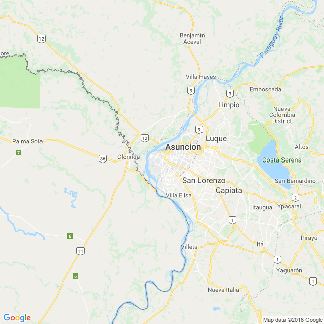
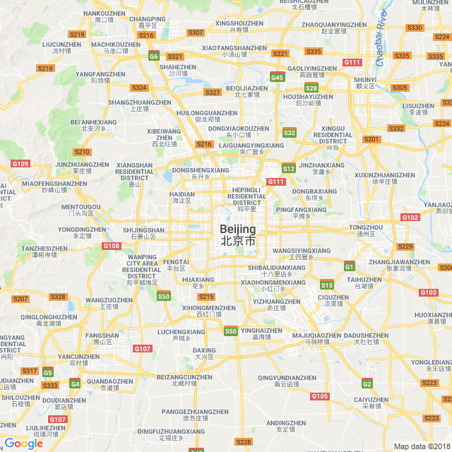

```{r setup, include=FALSE, echo = F, warning = F, message = F}
knitr::opts_chunk$set(echo = F)

# source("../worldfactbook.R")
load("../Data/factbook.Rdata")

library(ggthemes)
library(ggmap)
library(ggrepel)
library(ggalt)
map.world <- map_data("world")

library(rworldmap)
library(sp)
library(proj4)
library(rgdal)
library(RgoogleMaps)

library(tidyverse)

```

## Paraguay is landlocked


### Pictures

#### Subject-related


<!-- Source: http://www.moveabroadnow.com/wp-content/uploads/iguazu-falls-paraguay.jpg-->

#### Subject-unrelated


<!-- Source: https://upload.wikimedia.org/wikipedia/commons/f/f2/6990634-panda-hug.jpg -->

### Charts

#### Subject-related, Topic-unrelated

```{r, out.width = "60%"}
filter(population, name == "Paraguay") %>%
  select(name, age, Female, Male) %>%
  gather(key = gender, value = value, -name, -age) %>%
  mutate(value = as.numeric(value)) %>%
ggplot() + 
  geom_col(aes(x = age, y = value/1e6, fill = gender), position = "dodge") + 
  ggtitle("Paraguay's Population") + 
  xlab("") + 
  scale_y_continuous("Population (Millions)") + 
  scale_fill_discrete("Gender") + 
  theme(legend.position = c(1, 1), legend.justification = c(1,1), legend.background = element_rect(fill = "transparent"))
```

#### Subject-unrelated, Topic-unrelated

```{r, out.width = "60%"}
filter(population, name == "China") %>%
  select(name, age, Female, Male) %>%
  gather(key = gender, value = value, -name, -age) %>%
  mutate(value = as.numeric(value)) %>%
ggplot() + 
  geom_col(aes(x = age, y = value/1e6, fill = gender), position = "dodge") + 
  ggtitle("China's Population") + 
  xlab("") + 
  scale_y_continuous("Population (Millions)") + 
  scale_fill_discrete("Gender") + 
  theme(legend.position = c(1, 1), legend.justification = c(1,1), legend.background = element_rect(fill = "transparent"))
```

#### Subject-related, Topic-related (Probative)

```{r, out.width = "60%"}
filter(borders, name == "Paraguay") %>%
  unnest() %>%
  bind_rows(data_frame(name = "Paraguay", country = "Coast", length = unique(.$coast))) %>%
  arrange(desc(length)) %>%
  select(country, length) %>%
  mutate(country = factor(country, levels = country, ordered = T)) %>%
  ggplot() + 
  geom_bar(aes(x = country, y = length, fill = country), stat = "identity", color = "black") + 
  xlab("") + 
  ylab("Length (km)") + 
  scale_fill_brewer("Border With:", type = "qual", palette = "Paired", guide = F) +
  ggtitle("Paraguay's Border Regions")
```

#### Subject-unrelated, Topic-related 

```{r, out.width = "60%"}
filter(borders, name == "China") %>%
  unnest() %>%
  bind_rows(data_frame(name = "China", country = "Coast", length = unique(.$coast))) %>%
  arrange(desc(length)) %>%
  select(country, length) %>%
  mutate(row = row_number()) %>%
  mutate(country = ifelse(row <= 10, country, "Other")) %>%
  group_by(country) %>%
  summarize(length = sum(length), 
         row = min(row)) %>%
  arrange(row) %>%
  mutate(country = factor(country, levels = country, ordered = T)) %>%
  ggplot() + 
  geom_bar(aes(x = country, y = length, fill = country), stat = "identity", color = "black") + 
  xlab("") + 
  ylab("Length (km)") + 
  scale_fill_brewer("Border With:", type = "qual", palette = "Paired", guide = F) +
  ggtitle("China's Border Regions")
```

### Maps

#### Subject-related, topic-unrelated

```{r, out.width = "60%", include = F}
newmap <- GetMap(center = c(-25.3, -57.6333), zoom = 10, destfile = "AsuncionMap.png")
```



#### Subject-unrelated, topic-unrelated

```{r, out.width = "60%", include = F}
newmap <- GetMap(center = c(39.91667, 116.3833), zoom = 10, destfile = "BeijingMap.png")
```



#### Subject-related, topic-related (Non-probative)

```{r, out.width = "60%"}
lims <- filter(map.world, region == "Paraguay") %>%
  summarize(long_min = min(long), long_max = max(long), lat_min = min(lat), lat_max = max(lat))

ggplot(data = filter(map.world, region == "Paraguay")) + 
  geom_polygon(aes(x = long, y = lat, group = group), color = "black", fill = "grey70") + 
  geom_label(aes(x = label_long, y = label_lat, label = name), data = filter(location, name == "Paraguay")) + 
  coord_map(
    projection = "ortho",
    orientation = c(25, -57, 10),
    xlim = c(lims$long_min, lims$long_max),
    ylim = c(lims$lat_min, lims$lat_max)) + 
  theme_map()

```


#### Subject-unrelated, topic-related (Non-probative)

```{r, out.width = "60%"}
lims <- filter(map.world, region == "China") %>%
  summarize(long_min = min(long), long_max = max(long), lat_min = min(lat), lat_max = max(lat))

submap <- filter(map.world, 
                 long > lims$long_min*.98, 
                 long < lims$long_max*1.02, 
                 lat > lims$lat_min*.98, 
                 lat < lims$lat_max*1.02)
mapsubset <- filter(map.world, region %in% submap$region) %>%
  mutate(fill = region == "China")

ggplot(data = arrange(mapsubset, group, order)) + 
  geom_polygon(aes(x = long, y = lat, group = group, fill = fill), color = "black") + 
  scale_fill_manual(guide = F, values = c("FALSE" = "grey40", "TRUE" = "darkgreen")) + 
  coord_map(
    projection = "ortho",
    orientation = c(5, 110, 0),
    xlim = c(lims$long_min, lims$long_max),
    ylim = c(lims$lat_min, lims$lat_max)) + 
  theme(axis.text.x = element_blank(), axis.text.y = element_blank(), axis.title = element_blank(), axis.ticks = element_blank(),
        panel.background = element_rect(fill = "skyblue"))

rm(lims, submap, mapsubset)

```

#### Subject-related, topic-related (probative)

```{r, out.width = "60%", message = F, warning = F}
lims <- filter(location, simple == "South America") %>%
  summarize(long_min = min(label_long), long_max = max(label_long), lat_min = min(label_lat), lat_max = max(label_lat))

submap <- filter(map.world, 
                 long > lims$long_min, 
                 long < lims$long_max, 
                 lat > lims$lat_min, 
                 lat < lims$lat_max)
mapsubset <- filter(map.world, region %in% submap$region) %>%
  mutate(fill = region == "Paraguay")

ggplot(data = arrange(mapsubset, group, order)) + 
  geom_polygon(aes(x = long, y = lat, group = group, fill = fill), color = "black") + 
  scale_fill_manual(guide = F, values = c("FALSE" = "grey40", "TRUE" = "darkgreen")) + 
  coord_map(
    projection = "ortho",
    orientation = c(-5, -40, 0),
    xlim = c(lims$long_min, lims$long_max),
    ylim = c(lims$lat_min*.9, lims$lat_max)) + 
  theme(axis.text.x = element_blank(), axis.text.y = element_blank(), axis.title = element_blank(), axis.ticks = element_blank(),
        panel.background = element_rect(fill = "skyblue"))

rm(lims, submap, mapsubset)
```