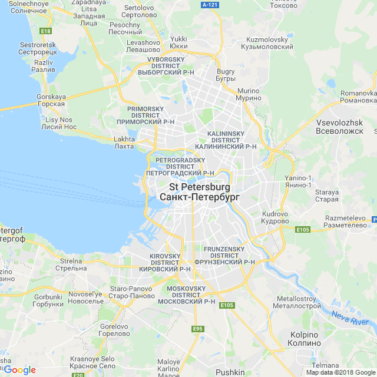

```{r setup, include=FALSE, echo = F, warning = F, message = F}
knitr::opts_chunk$set(echo = F)

load("../Data/factbook.Rdata")

library(ggthemes)
library(ggmap)
library(ggrepel)
library(ggalt)

library(rworldmap)
library(sp)
library(proj4)
library(rgdal)
library(RgoogleMaps)

library(tidyverse)

world <- readOGR("../Data/countries.geo.json", "OGRGeoJSON", stringsAsFactors=FALSE)
world_data <- data_frame(
  name = as.character(world@data$name),
  id = rownames(world@data)
)

world_map <- fortify(world) %>%
  left_join(world_data)

world <- map_data("world")
world2 <- map_data("world2")
```

## Russia has the longest coastal border of any country

### Pictures

#### Subject-related


<!-- Source: https://upload.wikimedia.org/wikipedia/commons/b/bc/St._Basil%27s_Cathedral%2C_Moscow.jpg -->

#### Subject-unrelated


<!-- Source: https://www.goodfreephotos.com/albums/india/other/man-riding-an-elephant-in-jaipur-india.jpg -->

### Charts

#### Subject-related, Topic-unrelated

```{r, out.width = "60%"}
filter(ethnicity, name == "Russia") %>%
  mutate(ethnicity = factor(ethnicity, levels = c("Bashkir", "Chechen", "Chuvash", "Russian", "Tatar", "Ukrainian", "Other"))) %>%
ggplot() + 
  geom_col(aes(x = ethnicity, y = pct, fill = ethnicity)) + 
  ggtitle("Russia's Ethnic Makeup") + 
  xlab("") + 
  scale_y_continuous("Percent of Population") + 
  scale_fill_brewer(guide = F, type = "qual", palette = "Dark2") + 
  theme(legend.position = c(1, 1), legend.justification = c(1,1), legend.background = element_rect(fill = "transparent"))
```

#### Subject-unrelated, Topic-unrelated

```{r, out.width = "60%"}
filter(ethnicity, name == "India") %>%
ggplot() + 
  geom_col(aes(x = ethnicity, y = pct, fill = ethnicity)) + 
  ggtitle("India's Ethnic Makeup") + 
  xlab("") + 
  scale_y_continuous("Percent of Population") + 
  scale_fill_brewer(guide = F, type = "qual", palette = "Dark2") + 
  theme(legend.position = c(1, 1), legend.justification = c(1,1), legend.background = element_rect(fill = "transparent"))
```

#### Subject-related, Topic-related (Probative)

```{r, out.width = "60%"}
borders %>%
  filter(!name %in% c("World", "European Union", "Antarctica") & ! str_detect(name, "Ocean")) %>%
  mutate(total = land.border + coast) %>%
  mutate(name = str_replace(name, "United States", "USA")) %>%
  arrange(desc(total)) %>%
  mutate(name = factor(name, levels =  name)) %>%
  filter(row_number() <= 10) %>%
  select(name, land = land.border, coast) %>%
  gather(key = type, value = value, land, coast) %>%
  mutate(type = factor(type, levels = c("land", "coast"))) %>%
  ggplot() + 
  geom_col(aes(x = name, y = value, fill = type)) + 
  scale_fill_wsj(name = "Border Type") + 
  xlab("") + 
  ylab("Length (km)") + 
  ggtitle("World's Longest Borders") + 
  theme(legend.position = c(1, 1), legend.justification = c(1, 1), legend.direction = "horizontal", legend.background = element_rect(fill = "transparent"))
```

#### Subject-unrelated, Topic-related 

```{r, out.width = "60%"}
borders %>%
  filter(!name %in% c("World", "European Union", "Antarctica") & ! str_detect(name, "Ocean")) %>%
  right_join(
    filter(location, str_detect(desc,"[Ee]astern Asia")), by = c("abbr", "name")
  ) %>%
  mutate(total = land.border + coast,
         name = str_replace(name, "Korea, (.*)", "\\1\nKorea")) %>%
  arrange(desc(total)) %>%
  mutate(name = factor(name, levels =  name)) %>%
  filter(row_number() <= 12) %>%
  select(name, land = land.border, coast) %>%
  gather(key = type, value = value, land, coast) %>%
  mutate(type = factor(type, levels = c("land", "coast"))) %>%
  ggplot() + 
  geom_col(aes(x = name, y = value, fill = type)) + 
  scale_fill_wsj(name = "Border Type") + 
  xlab("") + 
  ylab("Length (km)") + 
  ggtitle("Asia's Longest Borders") + 
  theme(legend.position = c(1, 1), legend.justification = c(1, 1), legend.direction = "horizontal", legend.background = element_rect(fill = "transparent"))
```

### Maps

#### Subject-related, topic-unrelated

```{r, out.width = "60%", include = F}
newmap <- GetMap(center = c(59.9375, 30.308611), zoom = 10, destfile = "StPetersburgMap.png")
```



#### Subject-unrelated, topic-unrelated

```{r, out.width = "60%", include = F}
newmap <- GetMap(center = c(28.613889, 77.208889), zoom = 10, destfile = "NewDelhiMap.png")
```

  


#### Subject-related, topic-related (Non-probative)

```{r, out.width = "60%"}
country <- "Russia"

world2 <- map_data("world2")
lims <- filter(world2, region == country) %>%
  summarize(long_min = min(long), long_max = max(long), lat_min = min(lat), lat_max = max(lat))

bc <- filter(borders, name == "Russia")$data[[1]]$country

fix_lims <- function(lims, scale = 0.01, maxfact = 1) {
  dir <- sign(lims) * c(-.25, .25, -.5, .5)
  fact <- pmin(maxfact, mean(scale * abs(as.numeric(lims))))
  fact*dir + lims
}

fixed_lims <- fix_lims(lims)

submap <- filter(world2,
                 long > fixed_lims$long_min,
                 long < fixed_lims$long_max,
                 lat > fixed_lims$lat_min,
                 lat < fixed_lims$lat_max)
mapsubset <- filter(world2, region %in% submap$region) %>%
  mutate(fill = region == country) %>%
  arrange(group, order) %>%
  group_by(group) %>%
  mutate(latmin = min(lat)) %>%
  ungroup() %>%
  filter(latmin < 78 | fill)

ggplot() + 
  geom_polygon(aes(x = long, y = lat, group = group, fill = fill), data = mapsubset, color = "black") + 
  scale_fill_manual(guide = F, values = c("FALSE" = "grey40", "TRUE" = "darkgreen")) + 
  coord_map(projection = "sp_albers", parameters = c(75, 35), orientation = c(90, 25, 78), xlim = c(27, 190), ylim = c(40, 70)) +
  theme_map() +
  theme(axis.text.x = element_blank(), axis.text.y = element_blank(), axis.title = element_blank(), axis.ticks = element_blank(),
        panel.background = element_rect(fill = "skyblue"))

rm(lims, submap, mapsubset)


```


#### Subject-unrelated, topic-related (Non-probative)

```{r, out.width = "60%"}
country <- "India"
lims <- filter(world_map, name == country) %>%
  summarize(long_min = min(long), long_max = max(long), lat_min = min(lat), lat_max = max(lat))

fix_lims <- function(lims, scale = 0.01, maxfact = 1) {
  dir <- sign(lims) * c(-.25, .25, -.5, .5)
  fact <- pmin(maxfact, mean(scale * abs(as.numeric(lims))))
  fact*dir + lims
}

fixed_lims <- fix_lims(lims)

submap <- filter(world_map, 
                 long > fixed_lims$long_min,
                 long < fixed_lims$long_max,
                 lat > fixed_lims$lat_min,
                 lat < fixed_lims$lat_max)
mapsubset <- filter(world_map, name %in% submap$name) %>%
  mutate(fill = name == country)

ggplot(data = arrange(mapsubset, group, order)) + 
  geom_polygon(aes(x = long, y = lat, group = group, fill = fill), color = "black") + 
  scale_fill_manual(guide = F, values = c("FALSE" = "grey40", "TRUE" = "darkgreen")) + 
  coord_map(xlim = c(fixed_lims$long_min, fixed_lims$long_max),
            ylim = c(fixed_lims$lat_min, fixed_lims$lat_max)) +
  theme(axis.text.x = element_blank(), axis.text.y = element_blank(), axis.title = element_blank(), axis.ticks = element_blank(),
        panel.background = element_rect(fill = "skyblue"))

rm(lims, submap, mapsubset)

```

#### Subject-related, topic-related (probative)

```{r, out.width = "60%"}
top10 <- borders %>%
  filter(!name %in% c("World", "European Union", "Antarctica") & ! str_detect(name, "Ocean")) %>%
  mutate(total = land.border + coast) %>%
  mutate(name = str_replace(name, "United States", "USA")) %>%
  arrange(desc(coast)) %>%
  mutate(name = factor(name, levels =  name), 
         rank = row_number()) %>%
  filter(row_number() <= 5) %>%
  select(name, land = land.border, coast, rank) %>%
  full_join(select(world_map, name, id) %>% unique)

gridlines1 <- expand.grid(
      long = c(-179, 179),
      lat = c(-60, -30, 0, 30, 60)
    ) %>%
      as_data_frame() %>%
      mutate(group = rep(1:5, each = 2))
gridlines2 <- expand.grid(long = c(-180, -150, -120, -90, -60, -30, 0, 30, 60, 90, 120, 150, 180),
                          lat = seq(-80, 80, by = 5)) %>%
  as_data_frame() %>%
  mutate(group = group_indices(., long)) %>%
  arrange(long)
      

ggplot() + 
  theme_map() + 
  geom_cartogram(aes(x = long, y = lat, map_id = id), data = world_map, map = world_map, color = "black") + 
  geom_line(aes(x = long, y = lat, group = group), data = gridlines1) + 
  geom_line(aes(x = long, y = lat, group = group), data = gridlines2) + 
  scale_fill_brewer("Coast\nLength", type = "qual", palette = "Dark2", na.value = "grey80") + 
  scale_color_brewer("Coast\nLength", type = "qual", palette = "Dark2", na.value = "grey20") + 
  geom_cartogram(aes(fill = factor(rank), map_id = id, color = factor(rank)), data = top10, map = world_map) + 
  coord_map("mollweide", ylim = c(-60, 90)) 
```
