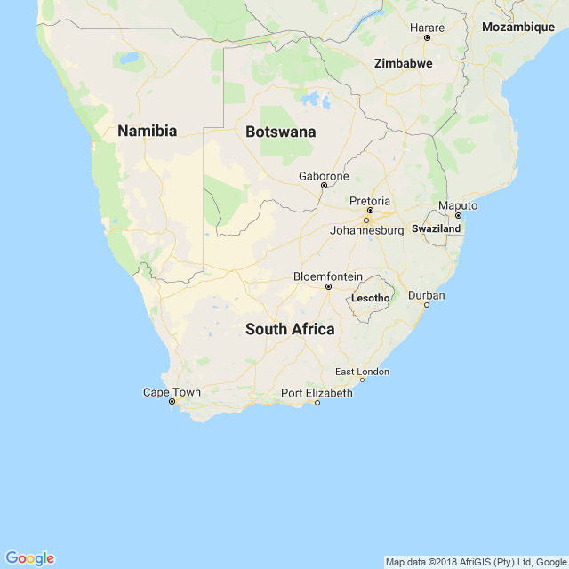
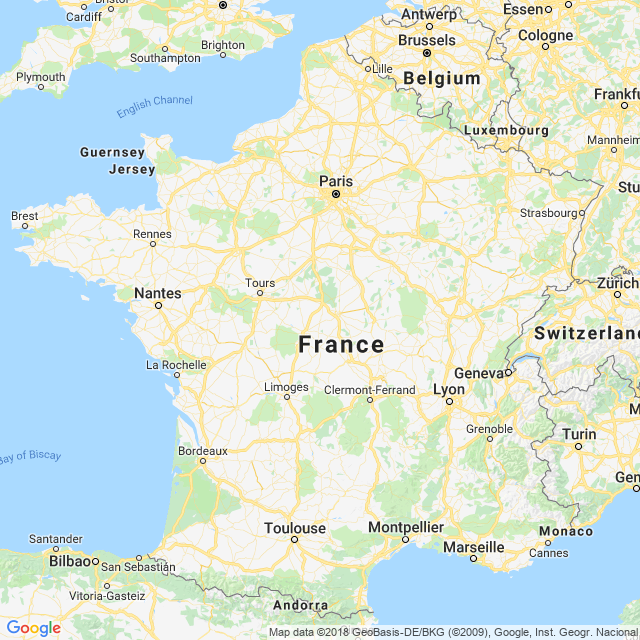

```{r setup, include=FALSE, echo = F, warning = F, message = F}
knitr::opts_chunk$set(echo = F, warning = F, message = F, dpi = 300)

# source(here::here("worldfactbook.R"))
load(here::here("Data/factbook.Rdata"))
export_col_theme <- sample(scales::hue_pal()(15), size = 15)

library(ggthemes)
library(ggmap)
library(ggrepel)
library(ggalt)

library(rworldmap)
library(sp)
library(proj4)
library(rgdal)
library(RgoogleMaps)

library(tidyverse)

world <- readOGR(here::here("Data/countries.geo.json"), "OGRGeoJSON", stringsAsFactors = FALSE)
world_data <- data_frame(
  name = as.character(world@data$name),
  id = rownames(world@data)
)

world_map <- fortify(world) %>%
  left_join(world_data)
rm(world_data)
world <- map_data("world")
world2 <- map_data("world2")
```

## South Africa has the lowest proportion of the population under 15 of all nations in Southern Africa


### Pictures

#### Subject-related


<!-- Source: https://upload.wikimedia.org/wikipedia/commons/c/cc/South_africa_-_zulu_reed_dance_ceremony_%286563648943%29.jpg-->

#### Subject-unrelated


<!-- Source: https://upload.wikimedia.org/wikipedia/commons/d/dc/Coulommiers_lait_cru.jpg -->

### Charts

#### Subject-related, Topic-unrelated

```{r, out.width = "60%"}
country <- "South Africa"
filter(borders, name == country) %>%
  unnest() %>%
  bind_rows(data_frame(name = country, country = "Coast", length = unique(.$coast))) %>%
  arrange(desc(length)) %>%
  select(country, length) %>%
  mutate(country = factor(country, levels = country, ordered = T)) %>%
  ggplot() + 
  geom_bar(aes(x = country, y = length, fill = country), stat = "identity") + 
  xlab("") + 
  ylab("Length (km)") + 
  scale_fill_brewer("Border With:", type = "qual", palette = "Dark2", guide = F) + 
  ggtitle(sprintf("%s's Border Regions", country))
```

#### Subject-unrelated, Topic-unrelated

```{r, out.width = "60%"}
country <- "France"
filter(borders2, name == country) %>%
  unnest() %>%
  bind_rows(data_frame(name = country, country = "Coast", length = 3427)) %>%
  arrange(desc(length)) %>%
  select(country, length) %>%
  mutate(country = factor(country, levels = country, ordered = T)) %>%
  ggplot() + 
  geom_bar(aes(x = country, y = length, fill = country), stat = "identity") + 
  xlab("") + 
  ylab("Length (km)") + 
  scale_fill_brewer("Border With:", type = "qual", palette = "Paired", guide = F) + 
  ggtitle(sprintf("%s's Border Regions", country))
```

#### Subject-related, Topic-related (Probative)

```{r, out.width = "60%"}
region <- "(Southern|Southwestern|Southeastern) Africa"
country <- "South Africa"
filter(location, str_detect(desc, region)) %>%
  select(name, label_lat, label_long) %>%
  left_join(population, by = 'name') %>%
  arrange(desc(label_lat), age) %>%
  mutate(name = factor(name, levels = unique(name)),
         age = factor(age, levels = rev(levels(age)))) %>%
  filter(!is.na(Pct)) %>%
  ggplot() + 
  geom_col(aes(x = name, y = Pct, fill = age), color = "black", position = "stack") + 
  scale_fill_brewer("Age", type = "qual", palette = "Greens") + 
  ggtitle("Age Distribution of Countries in Southern Africa") + 
  ylab("% Population") + 
  theme(axis.title.y = element_blank()) + 
  coord_flip()
```

#### Subject-unrelated, Topic-related 

```{r, out.width = "60%"}
region <- "(North)?(South)?[Ww]estern Europe"
country <- "France"
filter(location, str_detect(desc, region)) %>%
  select(name, label_lat, label_long) %>%
  left_join(population, by = 'name') %>%
  arrange(desc(label_lat), age) %>%
  mutate(name = factor(name, levels = unique(name)),
         age = factor(age, levels = rev(levels(age)))) %>%
  filter(!is.na(Pct)) %>%
  ggplot() + 
  geom_col(aes(x = name, y = Pct, fill = age), color = "black", position = "stack") + 
  scale_fill_brewer("Age", type = "qual", palette = "Greens") + 
  ggtitle("Age Distribution of Countries in Western Europe") + 
  ylab("% Population") + 
  theme(axis.title.y = element_blank()) + 
  coord_flip()
```

### Maps

#### Subject-related, topic-unrelated

```{r, out.width = "60%"}
x <- filter(location, name == "South Africa")
# newmap <- GetMap(center = c(x$label_lat, x$label_long), zoom = 5, destfile = "SouthAfricaMap.png")
if (!file.exists(here::here("Data/SouthAfricaMapTiles.Rdata"))) {
  SouthAfricamaptiles <- get_googlemap(center = c( x$label_long, x$label_lat), zoom = 5, maptype = "roadmap") 
  save(SouthAfricamaptiles, file = here::here("Data/SouthAfricaMapTiles.Rdata"))
} else {
  load(here::here("Data/SouthAfricaMapTiles.Rdata"))
}
SouthAfricamaptiles %>% ggmap() + 
  theme_map() 
```

<!--  -->

#### Subject-unrelated, topic-unrelated

```{r, out.width = "60%"}
x <- filter(location, name == "France")
# newmap <- GetMap(center = c(x$label_lat+1, x$label_long), zoom = 6, destfile = "FranceMap.png")
if (!file.exists(here::here("Data/FranceMapTiles.Rdata"))) {
  Francemaptiles <- get_googlemap(center = c( x$label_long, x$label_lat), zoom = 6, maptype = "roadmap") 
  save(Francemaptiles, file = here::here("Data/FranceMapTiles.Rdata"))
} else {
  load(here::here("Data/FranceMapTiles.Rdata"))
}
Francemaptiles %>% ggmap() + 
  theme_map() 
```

<!--  -->

#### Subject-related, topic-related (Non-probative)

```{r, out.width = "60%"}
region <- "(Southern|Southwestern|Southeastern|Central|Eastern) Africa"
region2 <- "(Southern|Southwestern|Southeastern) Africa"
tmp <- filter(location, str_detect(desc, region)) %>%
  select(name) %>%
  left_join(population, by = 'name') %>%
  mutate(name = str_replace_all(name, c("Eswatini" = "Swaziland", "Congo, Democratic Republic of the" = "Democratic Republic of the Congo"))) %>%
  filter(age == "25-54") %>%
  filter(!is.na(Pct)) %>%
  select(name, pct_working_age = Pct) %>%
  full_join(world, by = c("name" = "region"))

lims <- tmp %>%
  filter(is.na(subregion)) %>%
  right_join(filter(location, str_detect(desc, region2))) %>%
  select(lat, long) %>%
  summarize_all(.funs = funs(min, max), na.rm = T)


tmp %>%
  ggplot() + 
  geom_polygon(aes(x = long, y = lat, fill = pct_working_age, group = group), color = "black") + 
  coord_quickmap(xlim = c(lims$long_min, lims$long_max), ylim = c(lims$lat_min, -10), expand = T) + 
  theme(axis.text = element_blank(), axis.ticks = element_blank(), axis.title = element_blank()) + 
  scale_fill_gradient("% Population\n25-54", low = "white", high = "darkgreen", limits = c(25, 75)) + 
  ggtitle("Southern Africa Working-Age Population") + 
  theme(legend.position = c(1, 0), legend.justification = c(1, 0))
```


#### Subject-unrelated, topic-related (Non-probative)

```{r, out.width = "60%"}
region <- "Europe"
region2 <- "(North)?(South)?[Ww]estern Europe"
tmp <- filter(location, str_detect(simple, region)) %>%
  select(name) %>%
  left_join(population, by = 'name') %>%
  mutate(name = str_replace_all(name, c("United Kingdom" = "UK", "Congo, Democratic Republic of the" = "Democratic Republic of the Congo"))) %>%
  filter(age == "0-14") %>%
  filter(!is.na(Pct)) %>%
  select(name, pct_working_age = Pct) %>%
  full_join(world, by = c("name" = "region"))

lims <- tmp %>%
  filter(is.na(subregion)) %>%
  right_join(filter(location, str_detect(desc, region2))) %>%
  select(lat, long) %>%
  summarize_all(.funs = funs(min, max), na.rm = T)


tmp %>%
  ggplot() + 
  geom_polygon(aes(x = long, y = lat, fill = pct_working_age, group = group), color = "black") + 
  coord_quickmap(xlim = c(lims$long_min, lims$long_max), ylim = c(lims$lat_min, lims$lat_max), expand = T) + 
  theme(axis.text = element_blank(), axis.ticks = element_blank(), axis.title = element_blank()) + 
  scale_fill_gradient("% Population\n0-14", low = "white", high = "darkgreen", limits = c(10, 30)) + 
  ggtitle("Population under 15 years old") + 
  theme(legend.position = c(0, .6), legend.justification = c(0, .6), legend.direction = "vertical",
        legend.background = element_rect(fill = "white"))
```

#### Subject-related, topic-related (probative)

```{r, out.width = "60%", message = F, warning = F}
region <- "(Southern|Southwestern|Southeastern|Central|Eastern) Africa"
region2 <- "(Southern|Southwestern|Southeastern) Africa"
tmp <- filter(location, str_detect(desc, region)) %>%
  select(name) %>%
  left_join(population, by = 'name') %>%
  mutate(name = str_replace_all(name, c("Eswatini" = "Swaziland", "Congo, Democratic Republic of the" = "Democratic Republic of the Congo"))) %>%
  filter(age == "0-14") %>%
  filter(!is.na(Pct)) %>%
  select(name, pct_working_age = Pct) %>%
  full_join(world, by = c("name" = "region"))

lims <- tmp %>%
  filter(is.na(subregion)) %>%
  right_join(filter(location, str_detect(desc, region2))) %>%
  select(lat, long) %>%
  summarize_all(.funs = funs(min, max), na.rm = T)


tmp %>%
  ggplot() + 
  geom_polygon(aes(x = long, y = lat, fill = pct_working_age, group = group), color = "black") + 
  coord_quickmap(xlim = c(lims$long_min, lims$long_max), ylim = c(lims$lat_min, -10), expand = T) + 
  theme(axis.text = element_blank(), axis.ticks = element_blank(), axis.title = element_blank(), legend.position = c(1, 0), legend.direction = "horizontal", legend.justification = c(1, 0), legend.background = element_rect(fill = "transparent")) + 
  scale_fill_gradient("% Population\n0-14", low = "white", high = "darkgreen", limits = c(15, 50)) + 
  ggtitle("Population under 15 years old")
```