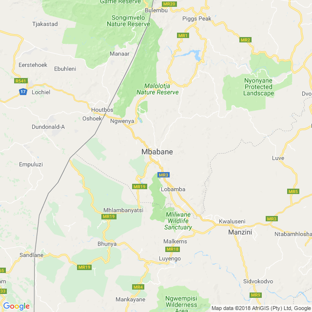
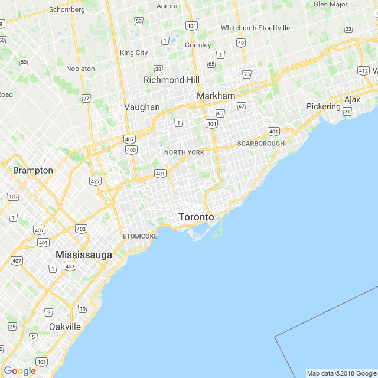

```{r setup, include=FALSE, echo = F, warning = F, message = F}
knitr::opts_chunk$set(echo = F, warning = F, message = F, dpi = 300)
# source(here::here("worldfactbook.R"))
load(here::here("Data/factbook.Rdata"))
export_col_theme <- sample(scales::hue_pal()(15), size = 15)

library(ggthemes)
library(ggmap)
library(ggrepel)
library(ggalt)
library(sf)

library(tidyverse)

world <- map_data("world")
world2 <- map_data("world2")
```

## Eswatini (Swaziland) only borders one country


### Pictures

#### Subject-related


<!-- Source: https://upload.wikimedia.org/wikipedia/commons/e/e3/Mswati_III_King_of_Swaziland.JPG-->

#### Subject-unrelated


<!-- Source: https://upload.wikimedia.org/wikipedia/commons/2/2d/Pavel_Kubina_Maple_Leafs.jpg -->

### Charts

#### Subject-related, Topic-unrelated

```{r, out.width = "60%"}
filter(population, name == "Eswatini") %>%
  select(name, age, Female, Male) %>%
  gather(key = gender, value = value, -name, -age) %>%
  mutate(value = as.numeric(value)) %>%
ggplot() + 
  geom_col(aes(x = age, y = value/1e3, fill = gender), position = "dodge") + 
  ggtitle("Eswatini's Population") + 
  xlab("Age") + 
  scale_y_continuous("Population (Thousands)") + 
  scale_fill_discrete("Gender") + 
  theme(legend.position = c(1, 1), legend.justification = c(1,1), legend.background = element_rect(fill = "transparent"))
```

#### Subject-unrelated, Topic-unrelated

```{r, out.width = "60%"}
filter(population, name == "Canada") %>%
  select(name, age, Female, Male) %>%
  gather(key = gender, value = value, -name, -age) %>%
  mutate(value = as.numeric(value)) %>%
ggplot() + 
  geom_col(aes(x = age, y = value/1e6, fill = gender), position = "dodge") + 
  ggtitle("Canada's Population") + 
  xlab("Age") + 
  scale_y_continuous("Population (Millions)") + 
  scale_fill_discrete("Gender") + 
  theme(legend.position = c(1, 1), legend.justification = c(1,1), legend.background = element_rect(fill = "transparent"))
```

#### Subject-related, Topic-related (Probative)

```{r, out.width = "60%"}
country <- "Eswatini"
filter(borders, name == country) %>%
  unnest() %>%
  # bind_rows(data_frame(name = country, country = "Coast", length = unique(.$coast))) %>%
  arrange(desc(length)) %>%
  select(country, length) %>%
  mutate(country = factor(country, levels = country, ordered = T)) %>%
  ggplot() + 
  geom_bar(aes(x = country, y = length, fill = country), stat = "identity") + 
  xlab("") + 
  ylab("Length (km)") + 
  scale_fill_brewer("Border With:", type = "qual", palette = "Dark2", guide = F) + 
  ggtitle(sprintf("%s's Border Regions", country))
```

#### Subject-unrelated, Topic-related 

```{r, out.width = "60%"}
country <- "Canada"
filter(borders, name == country) %>%
  unnest() %>%
  bind_rows(data_frame(name = country, country = "Coast", length = unique(.$coast))) %>%
  arrange(desc(length)) %>%
  select(country, length) %>%
  mutate(country = factor(country, levels = country, ordered = T)) %>%
  ggplot() + 
  geom_bar(aes(x = country, y = length, fill = country), stat = "identity") + 
  xlab("") + 
  ylab("Length (km)") + 
  scale_fill_brewer("Border With:", type = "qual", palette = "Dark2", guide = F) + 
  ggtitle(sprintf("%s's Border Regions", country))
```

### Maps

#### Subject-related, topic-unrelated

```{r, out.width = "60%"}
# newmap <- GetMap(center = c(-26.316667, 31.13333), zoom = 10, destfile = "EswatiniMap.png")

if (!file.exists(here::here("Data/EswatiniMapTiles.Rdata"))) {
  EswatiniMaptiles <- get_googlemap(center = c(31.13333, -26.316667), zoom = 10, maptype = "roadmap") 
  save(EswatiniMaptiles, file = here::here("Data/EswatiniMapTiles.Rdata"))
} else {
  load(here::here("Data/EswatiniMapTiles.Rdata"))
}
EswatiniMaptiles %>% ggmap() + 
  theme_map() + 
  ggtitle("Mbabane, Eswatini")
```

<!--  -->

#### Subject-unrelated, topic-unrelated

```{r, out.width = "60%"}
# newmap <- GetMap(center = c(43.7, -79.4), zoom = 10, destfile = "TorontoMap.png")

if (!file.exists(here::here("Data/TorontoMapTiles.Rdata"))) {
  TorontoMaptiles <- get_googlemap(center = c(-79.4, 43.7), zoom = 9, maptype = "roadmap") 
  save(TorontoMaptiles, file = here::here("Data/TorontoMapTiles.Rdata"))
} else {
  load(here::here("Data/TorontoMapTiles.Rdata"))
}
TorontoMaptiles %>% ggmap() + 
  theme_map() + 
  ggtitle("Toronto, Canada")
```

<!--  -->

#### Subject-related, topic-related (Non-probative)

```{r, out.width = "60%"}
continents <- sf::st_read(here::here("Data/Continents/Africa.shp"), type = 3) %>%
  st_crop(c(xmin = 13, xmax = 36, ymin = -36, ymax = -22)) %>%
  st_union()

lims <- filter(world, region == "Swaziland") %>%
  summarize(long_min = min(long), long_max = max(long), lat_min = min(lat), lat_max = max(lat))

ggplot(data = filter(world, region == "Swaziland")) + 
  geom_sf(data = continents, color = "black", fill = "grey70") + 
  geom_polygon(aes(x = long, y = lat, group = group), color = "black", fill = "white") + 
  geom_label(aes(x = label_long, y = label_lat, label = name), data = filter(location, name == "Eswatini")) + 
  coord_sf(xlim = c(15, 35), ylim = c(-34, -24)) +
  theme(axis.text = element_blank(), axis.ticks = element_blank(), axis.title = element_blank())
rm(lims)

```


#### Subject-unrelated, topic-related (Non-probative)

```{r, out.width = "60%"}
lims <- filter(world, region == "Canada") %>%
  summarize(long_min = min(long), long_max = max(long), lat_min = min(lat), lat_max = max(lat))
context <- filter(world, region %in% c("Canada", "USA"))

ggplot(data = filter(world, region == "Canada")) + 
  geom_polygon(aes(x = long, y = lat, group = group), data = context, color = "black", fill = "grey70") + 
  # theme_map() + 
  geom_polygon(aes(x = long, y = lat, group = group), color = "black", fill = "white") + 
  geom_label(aes(x = label_long, y = label_lat, label = name), data = filter(location, name == "Canada")) + 
  coord_map(projection = "ortho", xlim = c(lims$long_min, lims$long_max), ylim = c(lims$lat_min, lims$lat_ma)) + 
  theme(axis.text = element_blank(), axis.ticks = element_blank(), axis.title = element_blank())
rm(lims)

```

#### Subject-related, topic-related (probative)

```{r, out.width = "60%", message = F, warning = F}
lims <- filter(world, region == "Swaziland") %>%
  summarize(long_min = min(long), long_max = max(long), lat_min = min(lat), lat_max = max(lat))

gridlines1 <- expand.grid(
      long = c(-179, 179),
      lat = c(-60, -30, 0, 30, 60)
    ) %>%
      as_data_frame() %>%
      mutate(group = rep(1:5, each = 2))
gridlines2 <- expand.grid(long = c(-180, -150, -120, -90, -60, -30, 0, 30, 60, 90, 120, 150, 180),
                          lat = seq(-80, 80, by = 5)) %>%
  as_data_frame() %>%
  mutate(group = group_indices(., long)) %>%
  arrange(long)
      

fixed_lims <- lims * c(.5, 1.08, 1.31, .8)

submap <- filter(world,
                 long > fixed_lims$long_min,
                 long < fixed_lims$long_max,
                 lat > fixed_lims$lat_min,
                 lat < fixed_lims$lat_max)
mapsubset <- filter(world, region %in% submap$region) %>%
  arrange(group, order) %>%
  group_by(group) %>%
  mutate(latmin = min(lat)) %>%
  ungroup() 

locsubset <- filter(location, name %in% c(mapsubset$region, "Eswatini")) %>%
  filter(!name %in% c("Zimbabwe", "Mozambique"))

ggplot() + 
  # theme_map() + 
  geom_line(aes(x = long, y = lat, group = group), data = gridlines1) + 
  geom_line(aes(x = long, y = lat, group = group), data = gridlines2) + 
  ggpolypath::geom_polypath(aes(x = long, y = lat, group = group, fill = region), data = mapsubset, color = "black") + 
  geom_path(aes(x = long, y = lat, group = group), data = mapsubset, color = "black", size = .125) + 
  scale_fill_discrete(guide = F) + 
  geom_label_repel(aes(x = label_long, y = label_lat, label = name), data = locsubset) +
  coord_map(xlim = as.numeric(fixed_lims[,1:2]), ylim = as.numeric(fixed_lims[,3:4]))  +
  theme(legend.background = element_rect(fill = "white", color = "black")) + 
  theme(axis.text = element_blank(), axis.ticks = element_blank(), axis.title = element_blank())
```