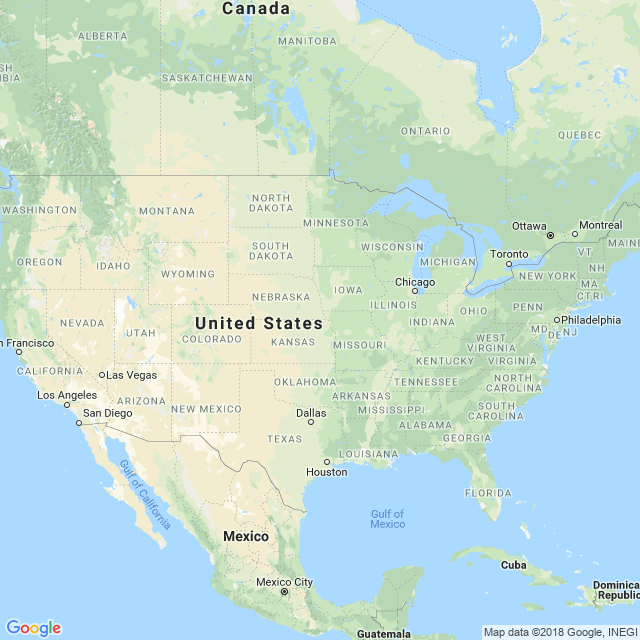

```{r setup, include=FALSE, echo = F, warning = F, message = F}
knitr::opts_chunk$set(echo = F, warning = F, message = F, dpi = 300)
# source("../worldfactbook.R")
load("../Data/factbook.Rdata")

library(ggthemes)
library(ggmap)
library(ggrepel)
library(ggalt)
map.world <- map_data("world")

library(RgoogleMaps)
library(rworldmap)
library(tidyverse)

world <- map_data("world")

nuclear <- read_csv("energy-pop-exposure-nuclear-plants-locations_plants.csv") %>%
  mutate(Country = str_replace_all(Country, c("UNITED STATES OF AMERICA" = "UNITED STATES",
                                              "CZECH REPUBLIC" = "CZECHIA", 
                                              "IRAN(.*)" = "IRAN",
                                              "KOREA, REPUBLIC OF" = "KOREA, SOUTH", 
                                              "RUSSIAN FEDERATION" = "RUSSIA", 
                                              "SLOVAK REPUBLIC" = "SLOVAKIA",
                                              "TAIWAN, CHINA" = "TAIWAN"))) %>%
  left_join(select(location, "name") %>% mutate(Country = str_to_upper(name)))

```

## Switzerland is one of three European countries who get more than 30% of their power from nuclear power plants


### Pictures

#### Subject-related


<!-- Source: https://commons.wikimedia.org/wiki/File:5325_Leibstadt,_Switzerland_-_panoramio.jpg-->

#### Subject-unrelated


<!-- Source: https://upload.wikimedia.org/wikipedia/commons/7/75/Cute_grey_kitten.jpg -->

### Charts

#### Subject-related, Topic-unrelated

```{r, out.width = "60%"}
filter(population, name == "Switzerland") %>%
  select(name, age, Female, Male) %>%
  gather(key = gender, value = value, -name, -age) %>%
  mutate(value = as.numeric(value)) %>%
ggplot() + 
  geom_col(aes(x = age, y = value/1e3, fill = gender), position = "dodge", color = "black") + 
  ggtitle("Population of Switzerland") + 
  xlab("Age") + 
  scale_y_continuous("Population (Thousands)") + 
  scale_fill_discrete("Gender") + 
  theme(legend.position = c(1, 1), legend.justification = c(1,1), legend.background = element_rect(fill = "transparent"))
```

#### Subject-unrelated, Topic-unrelated

```{r, out.width = "60%"}
filter(population, name == "United States") %>%
  select(name, age, Female, Male) %>%
  gather(key = gender, value = value, -name, -age) %>%
  mutate(value = as.numeric(value)) %>%
ggplot() + 
  geom_col(aes(x = age, y = value/1e6, fill = gender), position = "dodge", color = "black") + 
  ggtitle("Population of the United States") + 
  xlab("Age") + 
  scale_y_continuous("Population (Millions)") + 
  scale_fill_discrete("Gender") + 
  theme(legend.position = c(1, 1), legend.justification = c(1,1), legend.background = element_rect(fill = "transparent"))
```

#### Subject-related, Topic-related (Probative)

```{r, out.width = "60%"}
electricity_all %>%
  right_join(
    filter(location, simple == "Europe"),
    by = c("abbr", "name")
  ) %>%
  filter(!name %in% c("World", "European Union", "Antarctica") & ! str_detect(name, "Ocean")) %>%
  select(name, NuclearFuels, FossilFuels, HydroelectricPlants, OtherRenewableSources) %>%
  arrange(desc(NuclearFuels)) %>%
  filter(row_number() <= 12) %>%
  arrange(desc(FossilFuels)) %>%
  mutate(name = factor(name, levels = name, labels = str_replace(name, " ", "\n"))) %>%
  gather(key = type, value = value, -name) %>% 
  group_by(name) %>%
  mutate(value = value/sum(value)*100) %>%
  mutate(type = factor(type, 
    levels = c("NuclearFuels", "HydroelectricPlants", "OtherRenewableSources", 
               "FossilFuels", NULL), 
    labels = c("Nuclear", "Hydroelectric", "Renewables", "Fossil" ))) %>%
  ggplot() + 
  geom_col(aes(x = name, y = value, fill = type), color = "black") + 
  xlab("") + 
  ylab("Percent of Electrical Generation") + 
  scale_fill_manual("Type", values = c("Fossil" = "grey40", "Hydroelectric" = "#4292c6", "Nuclear" = "#ec7014", "Renewables" = "#41ab5d", "Other" = "#f768a1")) + 
  theme(legend.position = "bottom") + 
  ggtitle("Electrical Generation in Europe")
```

#### Subject-unrelated, Topic-related 

```{r, out.width = "60%"}
electricity_all %>%
  right_join(
    filter(location, simple == "North America"),
    by = c("abbr", "name")
  ) %>%
  filter(!name %in% c("World", "European Union", "Antarctica", "Greenland") & ! str_detect(name, "Ocean")) %>%
  select(name, NuclearFuels, FossilFuels, HydroelectricPlants, OtherRenewableSources) %>%
  arrange(desc(NuclearFuels)) %>%
  filter(row_number() <= 12) %>%
  arrange(desc(FossilFuels)) %>%
  mutate(name = factor(name, levels = name, labels = str_replace(name, " and ", "\nand "))) %>%
  gather(key = type, value = value, -name) %>% 
  group_by(name) %>%
  mutate(value = value/sum(value)*100) %>%
  mutate(type = factor(type, 
    levels = c("NuclearFuels", "HydroelectricPlants", "OtherRenewableSources", 
               "FossilFuels", NULL), 
    labels = c("Nuclear", "Hydroelectric", "Renewables", "Fossil" ))) %>%
  ggplot() + 
  geom_col(aes(x = name, y = value, fill = type), color = "black") + 
  xlab("") + 
  ylab("Percent of Electrical Generation") + 
  scale_fill_manual("Type", values = c("Fossil" = "grey40", "Hydroelectric" = "#4292c6", "Nuclear" = "#ec7014", "Renewables" = "#41ab5d", "Other" = "#f768a1")) + 
  theme(legend.position = "bottom") + 
  ggtitle("Electrical Generation in North America")
```

### Maps

#### Subject-related, topic-unrelated

```{r, out.width = "60%", include = T}
europemap <- GetMap(center = c(50, 10), zoom = 4, destfile = "EuropeMap.png")
```


#### Subject-unrelated, topic-unrelated
```{r, out.width = "60%", include = T}
usmap <- GetMap(center = c(40, -96), zoom = 4, destfile = "USMap.png")
```



#### Subject-related, topic-related (Non-probative)

```{r, out.width = "80%"}
plants <- filter(location, simple == "Europe") %>%
  select(name) %>%
  left_join(nuclear, by = "name") %>%
  filter(!is.na(Latitude)) %>%
  select(name, Plant, NumReactor, Latitude, Longitude) %>%
  nest(-name, -Plant) %>%
  mutate(data = map(data, ~.[rep(row.names(.), .$NumReactor),])) %>%
  unnest() %>%
  mutate(Latitude = jitter(Latitude, amount = .1), Longitude = jitter(Longitude, amount = .1))
# europemap <- get_map(location = 'Europe', zoom = 4)
# save(europemap, file = "EuropeMap.Rdata")
load("EuropeMap.Rdata")
ggmap(europemap) + 
  theme_void() + 
  geom_point(aes(x = Longitude, y = Latitude), shape = 1, data = plants) + 
  theme(axis.text.x = element_blank(), axis.text.y = element_blank(), axis.title = element_blank(), axis.ticks = element_blank(), legend.background = element_rect(fill = "transparent")) +
  ggtitle("Nuclear Power Plants in Europe")
```


#### Subject-unrelated, topic-related (Non-probative)

```{r, out.width = "80%"}
plants <- filter(location, simple == "North America") %>%
  select(name) %>%
  left_join(nuclear, by = "name") %>%
  filter(!is.na(Latitude)) %>%
  select(name, Plant, NumReactor, Latitude, Longitude) %>%
  nest(-name, -Plant) %>%
  mutate(data = map(data, ~.[rep(row.names(.), .$NumReactor),])) %>%
  unnest() %>%
  mutate(Latitude = jitter(Latitude, amount = .1), Longitude = jitter(Longitude, amount = .1))
# usmap <- get_map(location = 'Contenintal United States', zoom = 4)
# save(usmap, file = "USMap.Rdata")
load("USMap.Rdata")
ggmap(usmap) + 
  theme_void() + 
  geom_point(aes(x = Longitude, y = Latitude), shape = 1, data = plants) + 
  theme(axis.text.x = element_blank(), axis.text.y = element_blank(), 
        axis.title = element_blank(), axis.ticks = element_blank(), 
        legend.background = element_rect(fill = "transparent")) +
  ggtitle("Nuclear Power Plants in North America")
```

#### Subject-related, topic-related (probative)

```{r, out.width = "60%", message = F, warning = F}
europe_nuke <- filter(location, simple == "Europe" | name == "Russia") %>%
  select(name) %>%
  left_join(select(areas, name, total)) %>%
  left_join(select(electricity_all, name, NuclearFuels)) %>%
  mutate(name = str_replace(name, "United Kingdom", "UK") %>%
           str_replace("Czechia", "Czech Republic")) %>%
  filter(name != "Iceland") %>%
  arrange(desc(NuclearFuels)) %>%
  mutate(Nuke = cut(NuclearFuels, breaks = c(0, 5, 10, 15, 20, 25, 30, 40, 50), right = F, include.lowest = F) %>%
           as.character(),
         Nuke = ifelse(NuclearFuels == 0, "0", Nuke) %>%
           factor(levels = c("0", "[0,5)", "[5,10)", "[10,15)", "[15,20)", "[20,25)", "[25,30)", "[30,40)", "[40,50)")))

regions <- filter(map.world, long > -15, long < 25, lat < 70, lat > 37)

europe_nuke_map <- filter(world, region %in% regions$region) %>%
  filter(region != "Iceland") %>%
  left_join(europe_nuke, by = c("region" = "name"))

europe_nuke_labels <- filter(location, name %in% c(head(europe_nuke, 10)$name, "Spain", "Germany", "Italy", "Czechia", "Austria", "Poland")) %>%
  filter(!name %in% c("Slovenia", "Belgium"))

colorpal <- c("#FFFFFF", RColorBrewer::brewer.pal(name = "Paired", n = 10))[c(1:5,8:9,6:7)]
ggplot(data = europe_nuke_map) + 
  geom_polygon(aes(x = long, y = lat, fill = Nuke, group = group), color = "black") +
  coord_map(xlim = c(-14, 25), ylim = c(35, 63)) +
  theme(axis.text.x = element_blank(), axis.text.y = element_blank(), axis.title = element_blank(), axis.ticks = element_blank()) + 
  scale_fill_manual("% Electricity\nfrom\nNuclear", values = colorpal, na.value = "grey", drop = F) + 
  geom_text(aes(x = label_long, y = label_lat, label = name), data = europe_nuke_labels, hjust = .5, vjust = .5, size = 2.75)
```